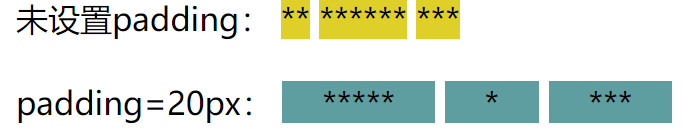
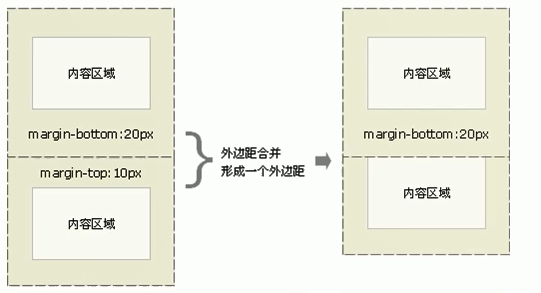
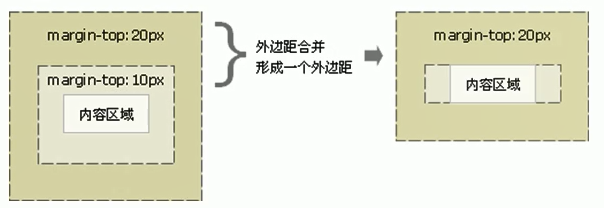
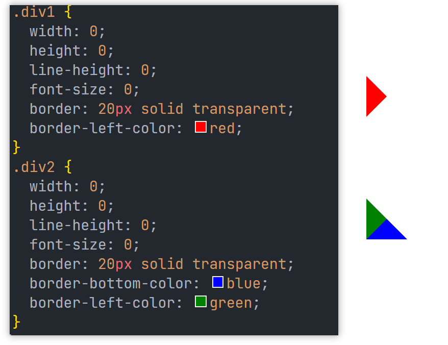
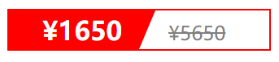

# HTML&CSS

[TOC]

## 第一部分 HTML 基础

### 一、常用标签

#### 1.1 标题标签

`<h1>~<h6>`

#### 1.2 段落标签

`<p>`

#### 1.3 换行标签

`<br />`

#### 1.4 文本格式化标签

1. 加粗：`<strong>`/`<b>`
2. 倾斜：`<em>`/`<i>`
3. 删除线：`<del>`/`<s>`
4. 下划线：`<ins>`/`<u>`

PS:`<b>/<i>/<s>/<u>`主要代表样式；`<strong>/<em>`主要表示对内容的强调，`<del> /<ins>`主要表示文档被编辑

#### 1.5 区块标签

1. `<div>`块级元素
2. `<span>`行内元素

#### 1.6 图像标签

1. ``  
   | 属性名称 | 值 | 备注 |
   | :-----: | :-----: | :---: |
   | src | 图片路径 | 必须属性 |
   | alt | 文本 | 替换文本，img 不能显示时的文字 |
   | title | 文本 | 提示文本，鼠标放上去的时候显示的文字 |
   | width | px | img 的高 |
   | height | px | img 的高 |
   | border | px | img 的边框粗细 |

2. 路径
   - 相对路径
   - 绝对路径

#### 1.7 超链接标签

`<a href="跳转目标" target="目标窗口弹出方式">文本&图像</a>`

1. href 是必须属性，目标的 URL 地址；target 设为\_blank 代表新窗口打开
2. 空链接：`<a href="#" >页面名称</a>`
3. 锚点链接
   1. 链接文本的 href 属性设为名字：`<a href="#two">二</a>`
   2. 目标位置标签加一个 Id 属性=名字：`<h3 id="two">第二页</h3>`

#### 1.8 表格标签

```html
<table>
  <tr>
    <th>表头单元格</th>
    <td>单元格内的文字1</td>
    <td>单元格内的文字2</td>
  </tr>
</table>
```

1. 表头单元格`<th>`
   - 文本内容会加粗居中显示
2. 属性
   - 多用 CSS 进行设置
3. 合并单元格
   - 跨行合并：rowspan="合并单元格的个数"
   - 跨列合并：colspan="合并单元格的个数"
   - 目标单元格
     - 跨行：最上侧的单元格
     - 跨列：最左侧的单元格
4. 合并后要将被合并的单元格删除

#### 1.9 列表标签

##### 1.9.1 无序列表

```html
<ul>
  <li>列表事项1</li>
  <li>列表事项2</li>
  ...
</ul>
```

ps:

1. 各列表项之间没有顺序级别之分，是并列的
2. `<ul>`中只能放`<li>`
3. `<li>`中可以放任何元素

##### 1.9.2 有序列表

```html
<ol>
  <li>list1</li>
  <li>list2</li>
  ...
</ol>
```

##### 1.9.3 自定义列表

```html
<dl>
  <dt>名词1</dt>
  <dd>名词解释1</dd>
  <dd>名词解释2</dd>
  ...
</dl>
```

#### 1.10 表单标签

> 目的：**收集用户信息**

##### 1.10.1 表单域

```html
<form action="url地址" method="提交方式" name="表单域名称">各种表单元素控件</form>
```

##### 1.10.2 表单元素

1. input 输入表单元素

   `<input type="属性值">`
   | 属性值 | 备注 | 属性值 | 备注 |
   | :-----: | :-------: | :----: | :-------: |
   | button | 可点击按钮 | checkbox | 复选框 |
   | file | 输入字段和提交按钮，供文件上传 | hidden | 隐藏的输入字段 |
   | image | 图像形式的提交按钮 | password | 密码字段，其中的字符被掩码 |
   | radio | 单选按钮 | reset | 重置，清除表单中的所有数据 |
   | submit | 提交 | text | 单行输入字段，默认宽度 20 字符 |

2. input 的其他属性

   | 属性值  |                     备注                     |  属性值   |              备注              |
   | :-----: | :------------------------------------------: | :-------: | :----------------------------: |
   |  name   |            定义 input 元素的名称             |   value   |      规定 input 元素的值       |
   | checked | 设为 checked->规定此元素首次加载时应当被选中 | maxlength | 规定输入字段中的字符的最大长度 |

   - name 和 value 都要有，主要给后台使用
   - 设置单、复选框的 name 时，需要给选项相同的 name

3. input 元素定义标注(label)

   > 用于绑定一个表单元素，当点击`<label>`标签内的文本时，浏览器自动将焦点转移到相应的表单元素上

   ```html
   <input type="radio" name="sex" id="men" />
   <label for="men">男</label>
   <input type="radio" name="sex" id="women" />
   <label for="women">女</label>
   ```

4. 多个选项时定义下拉列表(select)

   ```html
   <select>
     <option>选项1</option>
     <option>选项2</option>
     ...
   </select>
   ```

   select 中至少包含一对`<option>`  
   在`<option>`中定义`select="select"`时代表当前项时默认项

---

## 第二部分 CSS 基础

### 一、CSS 规范等

### 二、基础选择器

#### 2.1 标签选择器

#### 2.2 类选择器

```css
.red {
  color: red;
  属性2: 属性值2;
  ...;
}
```

```html
<div class="red">红色</div>
```

##### 2.2.1 命名规范

使用"."进行标识；  
命名规范->《Web 前端开发规范手册》

##### 2.2.2 多类名

1. 多个类名之间用空格分开
2. 可以将一些相同的样式放在一个类之中
3. 标签可以调用公共的类，然后再调用自己独有的类

#### 2.3 ID 选择器

```css
/* 为特定ID的元素设置样式，HTML中以ID属性设置选择器 */
#id名 {
  属性1: 属性值1;
  ...;
}
/* id属性只能在每个HTML文档中出现一次 */
```

#### 2.4 通配符选择器

> 选取页面中的所有元素，不需要调用，会自动使用

```css
* {
  margin: 0;
  padding: 0;
}
```

### 三、字体属性

#### 3.1 字体

```css
body{
    font-family:'Microsoft YaHei',tahoma,arial,'Hiragino Sans GB;
}
```

#### 3.2 字体大小

```css
body {
  /* Chrome默认16px */
  font-size: 16px;
}
```

#### 3.3 字体粗细

normal：400；bold：700；  
范围：100~900；没有单位！！！

```css
h2 {
  font-weight: 400;
}
```

#### 3.4 文字样式

默认：`font-style:normal;`斜体：`font-style:italic;`

#### 3.5 字体符合属性

```css
div {
  font: font-style font-weight font-size line-height font-family;
}
```

1. 不能换顺序
2. font-size&&font-family 不能省略

### 四、文本属性

#### 4.1 文本颜色

```css
div {
  color: #ffffff;
  background-color: blue;
  /* color: rgba(0,0,0,.4) */
}
```

#### 4.2 对齐文本

`text-align`;默认 left 左对齐

#### 4.3 装饰文本

`text-decoration`;默认 none  
可以添加下划线(underline);删除线(line-through);上划线(overline)

#### 4.4 文本缩进

`text-indent`用来指定文本第一行的缩进，通常是段落首行缩进  
`p{text-indent:20px;} -> p{text-indent:2em;}`

#### 4.5 行间距

`line-height`

### 五、CSS 的引入

1. 内部样式表
2. 行内样式表
3. 外部样式表
   - `<link rel="stylesheet" href="css_Path" />`

### 六、复合选择器

#### 6.1 后代选择器

可以选择父元素里面的子元素  
`父元素 子元素{样式声明};`

#### 6.2 子选择器

只能选择某元素的最近一级子元素  
`元素1>元素2{样式声明};`

#### 6.3 并集选择器

可以选择多组标签，同时为他们定义相同的样式  
`元素1,元素2{样式声明};`

#### 6.4 伪类选择器

##### 6.4.1 链接伪类选择器

1. `a:link` 选择所有未被访问的链接
2. `a:visited` 选择所有已被访问的链接
3. `a:hover` 选择鼠标指针位于其上的链接
4. `a:active` 选择活动的链接

##### 6.4.2 :focus 伪类选择器

用于选取获得焦点的表单元素

```css
input:focus {
  color: red;
  background-color: skyblue;
}
```

### 七、元素显示模式

#### 7.1 块元素

1. 独占一行
2. 高、宽、内外边距都可以控制
3. 宽度默认是父级的 100%
4. 容器，内部可以是块或行内元素
5. 文字类元素内不能使用块级元素

#### 7.2 行内元素

1. 相邻行内元素在一行上，一行可以显示多个
2. 高、宽直接设置无效
3. 默认宽度就是本身内容宽度
4. 只能容纳文本或其他行内元素
5. 链接里边不能再放链接

#### 7.3 行内块元素

``、`<input/>`、`<td>`同时具有块元素和行内元素的特点

1. 和相邻行内元素(行内块)在同一行，但是之间会有缝隙，一行可以显示多个
2. 默认宽度==内容宽度
3. 高度、行高及内外边距都可以控制

#### 7.4 元素模式的转换

```css
display: block;
display: inline;
display: inline-block;
```

### 八、CSS 的背景

#### 8.1 背景颜色

`background-color:颜色值;`  
通常定义在最后一组  
可以设置为`transparent | color`，其中透明为默认值

#### 8.2 背景图片

`background-image:none|url;`  
元素的背景图像，位于`background-color`的上层  
实际开发中常用于 logo、装饰小图片和超大的背景图片，便于控制位置(精灵图)

#### 8.3 背景平铺

`background-repeat:repeat|no-repeat|repeat-x|repeat-y;`

#### 8.4 背景图片位置

`background-position:x y;`  
其中 x、y 可以为方位名词(position)也可为精确数值(length)

1. 参数是 position
   - `position:top|center|bottom|left|center|right;`
   - 两个都是 position，前后顺序无关
   - 只指定一个方位名词，另一个省略，则另一个默认居中对齐
2. 参数是 length
   - `lenght:百分数|长度值(浮点+px);`
   - 第一个为 x，第二个为 y
   - 只指定一个数值，另一个省略，则数值代表 x，y 默认居中
3. 参数是混合单位
   - 第一个是 x，第二个是 y

#### 8.5 背景图像固定(背景附着)

`background-attachment:scroll|fixed;`  
背景图像是否固定或随着页面的剩余部分滚动，可以用于制作**视差滚动**的效果

#### 8.6 背景符合写法

`background:transparent url() reprat scroll x y;`

#### 8.7 背景色半透明

`background:rgba(0,0,0,.3);`or`background:rgba(0,0,0,0.3);`

### 九、CSS 三大特性

- 层叠性
- 继承性
- 优先级

#### 9.1 层叠性

> 相同的选择器设置相同的样式，一个会覆盖(层叠)另一个

层叠性原则
: （1）样式冲突，遵循就近原则，执行距离结构更近的样式
: （2）样式不冲突，不会层叠

#### 9.2 继承性

> 子标签会继承父标签的某些样式，eg.文本颜色、字号...**能够简化代码**

```html
<!-- 行高的继承，行高为当前元素的font-size的1.5倍 -->
body{ font:12px/1.5 "Microsoft YaHei"; }
```

#### 9.3 优先级

> 同一个元素指定多个选择器产生优先级

1. 选择器相同 => 执行层叠性

2. 选择器不同 => 根据选择器权重执行

   |      权重类型       |   权重   |
   | :-----------------: | :------: |
   |      继承或\*       | 0,0,0,0  |
   |     元素选择器      | 0,,0,0,1 |
   | 类选择器,伪类选择器 | 0,0,1,0  |
   |      ID 选择器      | 0,1,0,0  |
   | 行内样式`style=""`  | 1,0,0,0  |
   |    `!important`     |    ∞     |

3. 注意事项

   - 权重由四位数字组成，但是不会有进位
   - 可以理解为 类>元素，ID>类...
   - 等级判定从左至右，相同则看下一位
   - 继承的权重最低，不管父元素的权重
   - `<a/>`,链接浏览器默认有一个样式

4. 权重叠加

   > eg.  
   > div ul li -> 0,0,0,3  
   > .nav ul li -> 0,0,1,2

### 十、盒子模型

页面布局三大核心：盒子模型、浮动、定位

#### 10.1 盒子模型(Box Model 组成)

> 本质：HTML 页面中的元素，封装周围的 HTML 元素，包括边框、外边距、内边距和实际内容


#### 10.2 边框(border)

1. 组成及简写

   - 边框宽度`border-width`
   - 边框样式`border-style`
   - 边框颜色`border-color`
   - 简写(没有顺序区别)`border: 1px solid red;`

2. 表格的细线边框

   ```css
   /*相邻边框合并在一起*/
   border-collapse: collapse;
   ```

3. 边框会影响盒子的实际大小(额外增加)

#### 10.3 内边距(padding)

1. 写法

   ```css
   /*上下左右都有5px的边距*/
   padding: 5px;
   /*上下5px 左右10px*/
   padding: 5px 10px;
   /*上5px 左右10px 下20px*/
   padding: 5px 10px 20px;
   /*上5px 右10px 下20px 左30px*/
   padding: 5px 10px 20px 30px;
   ```

2. padding 影响盒子的实际大小
3. 如果盒子本身没有指定 width/height 属性，则此时的 padding 不会撑开盒子

**技巧**：不设置块(行内块)的 width，而是通过 padding 使各块的内边距相同


#### 10.4 外边距(margin)

1. 简写方式与 padding 相同
2. 让块级盒子水平居中
   - 盒子必须指定了宽度
   - 盒子左右外边距都设置为 auto
     - `margin: 0 auto;`
   - 行内元素/行内块：`text-aling : center;`
3. 外边距合并

   - 使用 margin 定义块元素的垂直外边距时
     - 相邻块元素垂直外边距的合并
     - 嵌套块元素垂直外边距的塌陷
   - 合并

     - 上下两个相邻的块元素，如果上边的块有 margin-bottom，下面的元素有 margin-top，则它们的垂直间距为 MAX{margin-top,margin-bottom}
     - 解决方法：尽量只给一个盒子添加 margin 值

       

   - 嵌套块元素垂直外边距塌陷

     - 对于两个嵌套关系的块元素，父元素有上边距的同时子元素也有，此时父元素会塌陷较大的外边距值
     - 解决方法：

       1. 为父元素定义上边框
       2. 为父元素定义 padding-top
       3. ▲ 为父元素添加 overflow:hidden

       

#### 10.5 清除网页元素(浏览器默认)内外边距

```css
/* css的第一行代码 */
* {
  padding: 0;
  margin: 0;
  /* 去掉li前边的项目符号 */
  list-style: none;
}
```

行内元素尽量只设置左右边距，不设置上下边距

#### 10.6 圆角边框(border-radius)

`border-radius:length;`  
length：半径，可以为数值或百分比  
圆形：将正方形的圆角设为 50%

#### 10.7 盒子阴影(box-shadow)

`box-shadow:h-shadow v-shadow blur spread color inset;`  
阴影不占用空间，不影响其他盒子排列
| 属性 | 说明 |
| :------: | :------: |
| h-shadow | 水平阴影位置，可<0，必需 |
| v-shadow | 垂直阴影位置，可<0，必需 |
| blur | 模糊距离 |
| spread | 尺寸 |
| color | rgba(0,0,0,.3) |
| inset | 内部阴影，默认值:outset(外部阴影) |

#### 10.8 文字阴影(text-shadow)

`text-shadow:h-shadow v-shadow blur color;`

### 十一、浮动(float)

传统布局方式(PC)
: 普通流(标准流/文档流)
: 浮动
: 定位

标准流：标签按照规定好的默认方式排列
: 块级占一行，从上往下依次排列
: 行内元素，从左到右顺序排列，碰到父元素边缘自动换行

**网页布局第一标准**
: 多个块级元素纵向排列找标准流
: 多个块级元素横向排列找浮动

#### 11.1 float

用于创建浮动框，将其移动到一边，直到左边缘或右边缘触及**包含块**(**父级**)或**另一个浮动框的边缘**  
`选择器{float:none|left|right;}`

#### 11.2 浮动特性

1. 浮动元素会脱离标准流(脱标)
   - 脱离标准流的控制(浮)移动到指定位置(动) -> 俗称：脱标
   - 浮动的盒子不再保留原先的位置
2. 如果多个盒子都设置了浮动，则它们会按照属性值一行内显示并且顶端对齐排列(装不下时会另起一行)
3. 浮动元素具有行内块特性
   - 任何元素都可以浮动，添加浮动后具有行内块元素特性
   - 如果块级盒子没有设置宽度，默认与父元素同宽，但加入浮动后大小依据内容决定

#### 11.3 浮动元素经常与标准流父级搭配使用

网页布局的策略：先用标准流的父元素排列上下位置；之后内部子元素采取浮动排列左右位置

**网页布局第二准则**：先设置盒子大小，之后再设置盒子的位置

#### 11.4 浮动布局注意点

1. 浮动和标准流父级搭配
2. 一个元素浮动了，理论上其他兄弟元素也要浮动，浮动的盒子只会影响浮动盒子后边的标准流

#### 11.5 清除浮动

父级不方便给 height，子盒子浮动不占位置 => 父级高度=0  
本质：清除浮动元素造成的影响(如果父级存在 height，则不需要清除)  
策略：闭合浮动  
`选择器{clear:left|right|both}` **几乎只用 clear:both**

总结(什么时候清除浮动)
: 父级没有高度
: 子盒子浮动了
: 影响下边布局了

#### 11.6 清除浮动的方法

清除浮动的方法
: 额外标签法(隔墙法)，W3C 推荐
: 父级添加 overflow 属性
: 父级添加 after 伪元素
: 父级添加双伪元素

1. 再浮动标签末尾添加一个空标签  
   要求这个新的空标签必须是块级元素
2. 给父级添加 overflow，属性用**hidden**/auto/scroll 均可
3. `:after`方式是 1 的升级版，也是添加给父元素

   ```css
   .clearfix:after {
     content: '';
     display: block;
     height: 0;
     clear: both;
     visibility: hidden;
   }
   .clearfix {
     /* IE6 7专有 */
     *zoom: 1;
   }
   ```

4. 双伪元素清除浮动，也是给父元素添加

   ```css
   .clearfix:before,
   .clearfix:after {
     content: '';
     display: table;
   }
   .clearfix:after {
     clear: both;
   }
   .clearfix {
     /* IE6 7专有 */
     *zoom: 1;
   }
   ```

### 十二、CSS 定位

将盒子定在某一个位置，所以定位也是在摆放盒子，按照定位的方式移动盒子  
定位=定位模式+边偏移

#### 12.1 边偏移

top、bottom、left、right 相对与父元素各个边的距离  
一个盒子同时具有{left、right}{top、bottom}的话先执行{left}{top}

#### 12.2 定位模式(position)

static：静态  
relative：相对  
absolute：绝对  
fixed：固定

##### 12.2.1 静态定位(static)

`选择器{position:static;}`  
默认的定位方式，无定位的意思

1. 按照标准流特性摆放位置，无边偏移
2. 很少使用

##### 12.2.2 相对定位(relative)

`选择器{position:relative;}`
元素在移动位置时，是相对于它原来的位置来说的

1. 相对**自己原来的位置**移动的(移动时的参照点时自己原来的位置)
2. 原来在标准流的位置**继续占有**(**不脱标**，继续保留原来位置)
3. 典型应用：当绝对定位的父级

##### 12.2.3 绝对定位(absolute)

`选择器{position:absolute;}`  
元素在移动位置时，是相对于他的父级元素来说的

1. 如果**没有祖先元素**或**祖先元素没有定位**，则以浏览器为准定位(Document)
2. 如果祖先元素有定位，则以最近一级的有定位组件元素为参考点
3. 绝对定位**不再占有**原先的位置(**脱标**)

##### 12.2.4 固定定位(fixed)

元素固定于浏览器可视区的位置(eg. 浏览器页面滚动，元素位置不变)

1. 以浏览器可视窗口为参照点移动元素
   - **跟父元素没有任何关系**
   - 不随滚动条滚动
2. **不占有**原先的位置
3. 固定在版心右侧位置
   - 让固定定位的盒子`left:50%;`，到达浏览器可视区(或版心)的一半位置
   - 让该盒子`margin-left:版心宽度的一半;`

##### 12.2.5 粘性定位(sticky)

相对定位和固定定位的混合

1. 以**浏览器的可视窗口为参照点**移动元素(固定定位特点)
2. 粘性定位**占有原先的位置**(相对定位特点)
3. 至少添加 top/left/right/bottom 中的一个才有效

#### 12.3 子绝父相

子级是绝对定位的话，父级要用相对定位

1. 子级绝对定位，不会占有位置，可以放到父盒子里的任何一个地方，不影响兄弟元素(绝对)
2. 父盒子需要加定位限制子盒子
3. 父盒子布局时需要占有位置(相对定位)

#### 12.4 定位叠放次序(z-index)

`选择器{z-index:1;}`

1. 数值可以为 0、正负整数，默认为 auto，数值越大，盒子越靠上
2. 如果值相同，则按照书写顺序，后来居上
3. **只有定位的盒子才有此属性**

#### 12.5 其他特性

1. 绝对定位的盒子水平居中(无法通过`margin:0 auto;`实现)

   - left(top)走 50%父容器 width(height)
   - margin 往 left(top)走自己盒子 width(height)的**负**的一半

2. 定位特殊特性(绝对定位和固定定位也和浮动类似)
   - 添加绝对定位/固定定位后可以直接设置 width/height -> 行内元素
   - 添加绝对定位/固定定位后如果不给 width/height，则默认大小是内容大小 -> 块级元素
3. 脱标的盒子不会触发外边距塌陷
4. 绝对定位/固定定位会完全压住盒子；浮动元素只会压住它下边的标准流盒子，但是不会压住文字(图片)

### 十三、元素的显示与隐藏

#### 13.1 display 显示隐藏

`display:none;` 隐藏对象 -> **不再占有**原来的位置  
`display:block;` 转换为块级/显示元素

#### 13.2 visibility 可见性

inherit -> 默认，继承  
visible -> 可视  
hidden -> 隐藏，**继续占有**原来的位置  
collapse -> 用于表格

#### 13.3 overflow 溢出

visible -> 默认，不剪切，不加滚动条  
hiddhidd -> 不显示  
scroll -> 总是显示滚动条  
auto -> 在需要时添加滚动条

### 十四、CSS 书写顺序

1. 布局定位顺序：display/position/float/clear/visibility/overflow
2. 自身属性：width/height/margin/padding/border/background
3. 文本属性：color/font/text-decoration/text-align/vertical-align/white-space/break-word
4. 其他属性：content/cursor/border-radius/box-shadow/text-shadow/background:liner-gradient...

### 十五、CSS 技巧

#### 15.1 版心&导航栏

1. 可以将版心定义为公共类

   ```css
   .w {
     width: 1200px;
     margin: auto;
   }
   ```

2. 导航栏
   - 实际开发中，使用`<li><li/>`包含链接`<a/>`的方法 => 更有条理；避免搜索引擎降权

#### 15.2 精灵图

**目的**：为了有效减少服务器接收和发送请求的次数，提高页面的加载速度  
**核心原理**：将网页中的一些小背景图整合到一张大图中，服务器只需要一次请求即可

1. 主要针对背景图片使用
2. 大图片又被称为 sprites 精灵图或雪碧图
3. 移动背景图片位置，使用`background-position`
4. 移动 X、Y

#### 15.3 字体图标(iconfont)

主要用于显示网页中通用、常用的一些小图标(看起来是图标，本质是字体，可以设置大小、颜色等；**无法代替精灵图**)

#### 15.4 CSS 三角

```css
div {
  width: 0;
  height: 0;
  line-height: 0;
  font-size: 0;
  border: 10px solid transparent;
  border-left-color: red;
}
```



#### 15.5 界面样式

1. 鼠标样式(cursor)

   `li{cursor:pointer;}`  
   default:默认 | pointer:小手 | move:移动 | text:文本 | not-allowed:禁止

2. 表单轮廓线(outline)

   `input{outline:none;}`

3. 防止拖拽文本域(resize)

   `textarea{resize:none;}`

#### 15.6 vertical-align

1. 经常用于设置图片或者表单(行内块元素)和文字垂直对齐

   `vertical-align:baseline|top|middle|bottom`  
   baseline:默认，放在父元素的基线上  
   top:把元素顶端与行内最高元素的顶端对齐  
   middle:把元素放在父元素的中部  
   bottom:把元素顶端与行内最低元素的顶端对齐

2. 解决图片底部默认空白缝隙问题

   - 给图片添加`vertical-align`属性(不能是 baseline)
   - 把图片转化为块级元素

#### 15.7 溢出的文字使用省略号显示

1. 单行文本

   ```css
   /* 1. 强制一行内显示文本，默认为normal多行显示 */
   white-space: nowrap;
   /* 2. 超出部分隐藏 */
   overflow: hidden;
   /* 3. 文字用省略号代替超出的部分 */
   text-overflow: ellipsis;
   ```

2. 多行文本

   有较大兼容性问题，适合 webkit 内核浏览器或者移动端

   ```css
   overflow: hidden;
   text-overflow: ellipsis;
   /* 弹性伸缩盒子模型显示 */
   display: -webkit-box;
   /* 限制在一个块元素显示的文本的行数 */
   -webkit-line-clamp: 2;
   /* 设置或检索伸缩盒对象的子元素的排列方式 */
   -webkit-box-orient: vertial;
   ```

#### 15.8 常见布局技巧

1. margin 负值运用

   - 让每个盒子 margin 往左移动 x px 正好压住相邻盒子的边框
   - 鼠标经过某个盒子时提高当前盒子的层级即可 //边框变化

     没有定位，则加相对定位，有定位加 z-index

2. 文字围绕浮动元素

   运用浮动元素不会压住盒子的特性

3. 行内块制作页码
4. 三角强化



```html
<div class="price">
  <span class="miaosha">
    ¥1650
    <i></i>
  </span>
  <span class="origin">¥5650</span>
</div>
```

```html
<style>
  .price {
    width: 160px;
    height: 24px;
    line-height: 24px;
    border: 1px solid red;
    margin: 0 auto;
  }
  .miaosha {
    position: relative;
    float: left;
    width: 90px;
    height: 100%;
    background-color: red;
    text-align: center;
    color: #fff;
    font-weight: 700;
    margin-right: 8px;
  }
  .miaosha i {
    position: absolute;
    right: 0;
    top: 0;
    width: 0;
    height: 0;
    border-color: transparent #fff transparent transparent;
    border-style: solid;
    border-width: 24px 10px 0 0;
  }
  .origin {
    font-size: 12px;
    color: gray;
    text-decoration: line-through;
  }
</style>
```

#### 15.9 CSS 初始化

不同 Browser 对有些标签的默认样式不同，初始化可以消除对于 HTML 的差异 -> 重设 Browser 的样式

---

## 第三部分 HTML&CSS 进阶

### 一、HTML5 新特性

### 二、CSS3 新特性
