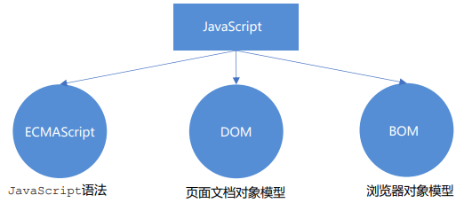
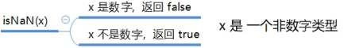
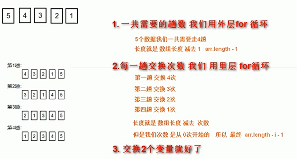
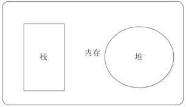
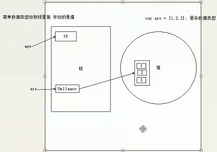

# JavaScript

[TOC]

---

## Part 1 基础部分

### 一、初识 JavaScript

&emsp;是一种运行在客户端的脚本语言(解释型语言，但是对于解释型和编译型二者对立存在争议)

> 脚本语言：不需要编译，运行过程中由 JS 解释器逐行进行解释并运行

#### 1.1 Browser & JavaScript

&emsp;浏览器分为两部分

1. 渲染引擎：用来解析 HTML 与 CSS，俗称内核
2. JS 引擎：也称为 JS 解释器。 用来读取网页中的 JavaScript 代码，对其处理后运行

> 浏览器本身并不会执行 JS 代码，而是通过内置 JavaScript 引擎(解释器) 来执行 JS 代码 。JS 引擎执行代码时逐行解释每一句源码（转换为机器语言），然后由计算机去执行，所以 JavaScript 语言归为脚本语言，会逐行解释执行。

#### 1.2 JavaScript 的组成



1. ECMAScript
   - 由 ECMA 国际（ 原欧洲计算机制造商协会）进行标准化的一门编程语言，这种语言在万维网上应用广泛，它往往被称为 JavaScript 或 JScript，但实际上后两者是 ECMAScript 语言的实现和扩展。
   - ECMAScript 规定了 JS 的编程语法和基础核心知识，是所有浏览器厂商共同遵守的一套 JS 语法工业标准。
2. DOM
   - 文档对象模型（Document Object Model，简称 DOM）
   - 是 W3C 组织推荐的处理可扩展标记语言的标准编程接口。通过 DOM 提供的接口可以对页面上的各种元素进行操作（大小、位置、颜色等）。
3. BOM
   - 浏览器对象模型（Browser Object Model，简称 BOM）
   - 提供了独立于内容的、可以与浏览器窗口进行互动的对象结构。通过 BOM 可以操作浏览器窗口，比如弹出框、控制浏览器跳转、获取分辨率等。

#### 1.3 书写

1. 行内式  
   `<input type="button" value="点我试试" onclick="alert('Hello World')" />`
2. HTML 内嵌  
   `<script>alert('Hello World~!');</script>`
3. 外部 JS 文件  
   `<script src="my.js"></script>`

#### 1.4 输入输出语句

|        方法        |                      说明                      |  归属   |
| :----------------: | :--------------------------------------------: | :-----: |
|    `alert(msg)`    |                浏览器弹出警示框                | Browser |
| `console.log(msg)` |            浏览器控制台打印输出信息            | Browser |
|   `prompt(info)`   | 浏览器弹出输入框，用户可以输入，传入值为字符串 | Browser |

### 二、JavaScript 变量

1. 本质：是程序在内存中申请的一块用于存放数据的空间
2. 声明：`var i;`
3. 赋值：`i = 1;`
4. 初始化：

   ```javascript
   var myname = 'name';
   var age = 18;
   ```

5. 声明变量的特殊情况

   |             情况             |                说明                |   结果    |
   | :--------------------------: | :--------------------------------: | :-------: |
   | `var age; console.log(age);` |           只声明，不赋值           | undefined |
   |     `console.log(age);`      |       不声明不赋值，直接调用       |   报错    |
   |  `age=9; console.log(age);`  | 不声明直接赋值，会变成**全局变量** |     9     |

### 三、数据类型

&emsp;JavaScript 是一种弱类型或者说动态语言，相同变量可以用作不同类型（不用提前声明变量类型，运行过程中自动确定）

#### 3.1 分类

1. 简单数据类型：Number、String、Boolean、Undefined、Null
2. 复杂数据类型：Object

#### 3.2 简单数据类型

##### 3.2.1 Number

1. 范围
   - 最大值：`Number.MAX_VALUE` -> 1.7976931348623157e+308
   - 最小值：`Number.MIN_VALUE` -> 5e-324
2. 三个特殊值
   - Infinity -> 代表无穷大，大于任何数值
   - -Infinity -> 代表无穷小，小于任何数值
   - NaN -> Not a number，代表一个非数值
3. isNaN()
   - 用来判断一个变量是否为非数字的类型，返回 true 或者 false
     

##### 3.2.2 String

1. 嵌套：可以用单引号嵌套双引号，或者用双引号嵌套单引号(外双内单，外单内双)
2. 转义符

   | 转义符 | 解释说明 |
   | :----: | :------: |
   |  `\n`  |   换行   |
   |  `\\`  |   斜杠   |
   |  `\'`  |  单引号  |
   |  `\"`  |  双引号  |
   |  `\t`  |   Tab    |
   |  `\b`  |   空格   |

3. 字符串长度：`str.length`
4. 字符串拼接

   ```javascript
   // 1.1 字符串 "相加"
   alert('hello' + ' ' + 'world'); // hello world
   // 1.2 数值字符串 "相加"
   alert('100' + '100'); // 100100
   // 1.3 数值字符串 + 数值
   alert('11' + 12); // 1112
   console.log('age:' + 18); // 只要有字符就会相连
   var age = 18;
   console.log('age:' + age); // age:18
   console.log('小明' + age + '岁啦'); // 小明18岁啦
   ```

#### 3.3 数据类型转换

1. 转换为字符串

   |        方式        |             说明             |        eg.        |
   | :----------------: | :--------------------------: | :---------------: |
   |    `toString()`    |         转换成字符串         | `num.toString();` |
   |     `String()`     |       强制转换成字符串       |  `String(num);`   |
   | **加号拼接字符串** | 和字符串拼接的结果都是字符串 |    -,隐式转换     |

2. 转换成数字

   |         方式         |                       说明                        |
   | :------------------: | :-----------------------------------------------: |
   |  `parseInt(string)`  |  提取以数值开头的 string 中的第一个 NaN 前的 Int  |
   | `parseFloat(string)` | 提取以数值开头的 string 中的第一个 NaN 前的 Float |
   |      `Number()`      |                 强制转换成数字串                  |
   |     JS 隐式转换      |             利用算数运算进行隐式转换              |

### 四、运算符

#### 4.1 算数运算符

&emsp;加(+)、减(-)、乘(\*)、除(/)、取余(取模,%)，浮点运算同样具有精度问题 => 不能直接比较浮点数是否相等

#### 4.2 自增运算符

&emsp; ++、--

#### 4.3 关系运算符

| 运算符  |             说明             |  案例   | 结果  |
| :-----: | :--------------------------: | :-----: | :---: |
|    <    |             小于             |   1<2   | true  |
|    >    |             大于             |   1>2   | false |
|   <=    |           小于等于           |  2<=2   | true  |
|   >=    |           大于等于           |  3<=2   | false |
|   ==    |       等于(**会转型**)       | 2==’2‘  | true  |
|   !=    |       不等(**会转型**)       | 2!='2'  | false |
| === !== | 全等，要求值和数据类型都相同 | 2===’2‘ | false |

#### 4.4 逻辑运算符

&emsp;And(\&\&),Or(||),Not(!)

#### 4.5 短路运算

&emsp;逻辑中断，当有多个表达式(值)时，左边的表达式可以确定结果就不再运算右边的表达式

1. AND：表达式 1 && 表达式 2
   - 表达式 1 为 true，返回表达式 2 的值
   - 表达式 1 为 false，返回 false
2. OR：表达式 1 || 表达式 2
   - 表达式 1 为 true，返回 true
   - 表达式 1 为 false,返回表达式 2 的值

#### 4.6 赋值运算符

&emsp;=、+=、-=、\*=、/=

#### 4.7 运算符优先级

| 优先级 |   运算符   |      顺序      |
| :----: | :--------: | :------------: |
|   1    |   小括号   |       ()       |
|   2    | 一元运算符 |    ++ -- !     |
|   3    | 算数运算符 | 先\* / % 后+ - |
|   4    | 关系运算符 |   > >= < <=    |
|   5    | 相等运算符 | == != === !==  |
|   6    | 逻辑运算符 |  先&& 后 \|\|  |
|   7    | 赋值运算符 |       =        |
|   8    | 逗号运算符 |       ,        |

### 五、流程控制

> 顺序结构、分支结构、循环结构

#### 5.1 分支

1. 分支语句(if)

   ```Javascript
   if (条件表达式) {
     // 执行语句1;
   }else if{
     // 执行语句2;
   }else{
     // 执行语句3;
   }
   ```

2. 三元表达式
   `条件表达式?表达式1:表达式2`
3. 多分支语句(switch)

   ```Javascript
    switch(表达式){
        case value1:
            执行语句1;
            break;
        case value2:
            执行语句2;
            break;
        default:
            执行语句;
    }
   ```

#### 5.2 循环

1. for 循环

   ```javascript
   for (初始化变量; 条件表达式; 操作表达式) {
     // 循环体
   }
   ```

2. 打印倒三角

   ```javascript
   // 打印倒三角
   var str = '';
   for (var i = 0; i < 10; i++) {
     for (var j = 0; j < 10; j++) {
       str = str + '★';
     }
     str += '\n';
   }
   console.log(str);
   ```

3. 九九乘法表

   ```javascript
   // 九九乘法表
   // 一共有9行，但是每行的个数不一样，因此需要用到双重 for 循环
   // 外层的 for 循环控制行数 i ，循环9次 ，可以打印 9 行
   // 内层的 for 循环控制每行公式  j
   // 核心算法：每一行 公式的个数正好和行数一致， j <= i;
   // 每行打印完毕，都需要重新换一行
   var str = '';
   for (var i = 1; i <= 9; i++) {
     // 外层循环控制行数
     for (var j = 1; j <= i; j++) {
       str += j + '×' + i + '=' + i * j + '\t';
     }
     str += '\n';
   }
   console.log(str);
   ```

4. while 循环

   ```javascript
   while (条件表达式) {
     // 循环体
   }
   ```

5. do while 循环

   ```javascript
   do {
     // 循环体
   } while (条件表达式);
   ```

6. continue
   用于立即跳出本次循环，继续下一次循环
7. break
   用于立即跳出整个循环

### 六、数组

#### 6.1 数组

1. 创建数组
   - 可以存放任意类型的数据
   - `var arrayName = new Array();`
   - 利用数组字面量创建：`var arrayName=[];`
2. 索引(下标)
3. 遍历
   - 获取长度：`数组名.length`
4. 新增元素
   1. length 属性是可读写的，可以通过修改 length 的值实现扩容；新增加的默认为 undefined
   2. 新增数组元素，修改索引号 -> `array[5]='blue';`
5. 筛选数组

   ```javascript
   var arr = [2, 0, 6, 1, 77, 0, 52, 0, 25, 7];
   var newArr = [];
   // 刚开始 newArr.length 就是 0
   for (var i = 0; i < arr.length; i++) {
     if (arr[i] >= 10) {
       // 新数组索引号应该从0开始 依次递增
       newArr[newArr.length] = arr[i];
     }
   }
   console.log(newArr);
   ```

6. 反转数组

   ```javascript
   // 将数组 ['red', 'green', 'blue', 'pink', 'purple'] 的内容反过来存放
   // 1、声明一个新数组 newArr
   // 2、把旧数组索引号第4个取过来（arr.length - 1)，给新数组索引号第0个元素 (newArr.length)
   // 3、我们采取 递减的方式  i--
   var arr = ['red', 'green', 'blue', 'pink', 'purple', 'hotpink'];
   var newArr = [];
   for (var i = arr.length - 1; i >= 0; i--) {
     newArr[newArr.length] = arr[i];
   }
   console.log(newArr);
   ```

#### 6.2 冒泡排序

> 冒泡排序(英文 Bubble Sort)，是一种最基础的交换排序。之所以叫做冒泡排序，因为每一个元素都可以像小气泡一样，根据自身大小一点一点向数组的一侧移动。

&emsp;每一趟只能确定将一个数归位。即第一趟只能确定将末位上的数归位，第二趟只能将倒数第 2 位上的数归位，依次类推下去。如果有 n 个数进行排序，只需将 n-1 个数归位，也就是要进行 n-1 趟操作。而 “每一趟 ” 都需要从第一位开始进行相邻的两个数的比较，将较大的数放后面，比较完毕之后向后挪一位继续比较下面两个相邻的两个数大小关系，重复此步骤，直到最后一个还没归位的数。

```javascript
// 冒泡排序
// var arr = [5, 4, 3, 2, 1];
var arr = [4, 1, 2, 3, 5];
// 外层循环管趟数
for (var i = 0; i < arr.length - 1; i++) {
  // 里面的循环管 每一趟的交换次数
  for (var j = 0; j < arr.length - i - 1; j++) {
    // 内部交换2个变量的值 前一个和后面一个数组元素相比较
    if (arr[j] > arr[j + 1]) {
      var temp = arr[j];
      arr[j] = arr[j + 1];
      arr[j + 1] = temp;
    }
  }
}
console.log(arr);
```




### 七、函数

#### 7.1 声明与调用

1. 声明函数

   - 命名函数

   ```javascript
       function funcName(形参...){
           // 函数体
       }
   ```

   - 函数表达式(匿名函数):`var 变量名 = function(){};`

2. 调用函数：
   - `函数名(实参)`

#### 7.2 参数

1. 实参与形参

   | 参数 |                              说明                              |
   | :--: | :------------------------------------------------------------: |
   | 形参 |  **形式**上的参数，函数**定义时**传递的参数，当前不知道是什么  |
   | 实参 | **实际**上的参数，函数**调用时**传递的参数，实参时传递给形参的 |

2. 形参与实参个数不匹配

   |      参数个数      |                 说明                 |
   | :----------------: | :----------------------------------: |
   | 实参个数==形参个数 |             输出正确结果             |
   |       实>形        |           只取到形参的个数           |
   |       实<形        | 多的形参定义为 undefined，结果为 NaN |

3. 返回值
   - 终止函数
   - 只返回一个值，如果有多个值，以最后一个为准
   - 没有 return 则返回 undefined
4. arguments
   - 是当前函数的一个内置对象。存储了传递的所有实参
   - arguments 展示形式是一个伪数组
     - 具有 length 属性
     - 按索引方式储存数据
     - 不具有数组的 push , pop 等方法

### 八、作用域

> => 提高程序可靠性&减少命名冲突，JS 在 ES6 的时候新增了块级作用域

1. 全局作用域
   - 全局变量
   - 在函数内部，没有直接声明直接赋值的变量也属于全局变量
   - 全局变量只有当 Browser 关闭时才会销毁，比较占用内存资源
2. 局部作用域
   - 局部变量
   - 函数的形参也可以看作局部变量
   - 局部变量当程序执行完就会销毁
3. 作用域链
   - 内部函数访问外部函数的变量，采取链式查找的方法决定取哪个值
   - 就近原则

### 九、预解析

&emsp;JS 引擎运行 JS 时分为两步：

1. 预解析(JS 引擎会将 JS 里边所有的 Var 和 Function 提升到当前作用域的最前边)
   - 变量预解析(变量提升)：把所有的变量声明提升到当前作用域的最前面，不提升赋值操作
   - 函数预解析(函数提升)：把所有的函数声明提升到当前作用域的最前面，不调用函数
2. 代码执行(按照代码书写顺序从上往下执行)

### 十、对象

&emsp;对象是一组无序的相关属性(事物的特征)和方法(事物的行为)的集合

#### 10.1 创建对象

1. 利用字面量创建对象

   - 属性或方法使用键值对
   - 用逗号分隔
   - 方法后跟匿名函数

   ```javascript
   var obj = {
     uname: '小明',
     age: 18,
     sex: '男',
     sayHi: function () {
       console.log('Hi!');
     },
   };
   ```

2. 使用 new Object 创建对象

   ```javascript
    // 创建了一个空的对象
    var obj = new Object();
    // 利用等号赋值的方式添加对象属性和方法
    obj.uname: '小明';
    obj.age: 18;
    obj.sex: '男';
    obj.sayHi: function () {
        console.log('Hi!');
    }
   ```

3. 利用构造函数创建对象

   - 构造函数：一种特殊的函数，主要用来初始化对象
     - 泛指某一大类，_类似于 Java 中的类_
     - 构造函数名字首字母要大写
     - 不需要 return
     - 调用必须使用 new
   - 利用构造函数创建对象的**过程**也称为**对象的实例化**

   ```javascript
   function 构造函数名() {
     this.属性 = 值;
     this.方法 = function () {};
   }
   new 构造函数名();
   ```

4. new 在执行时会做的四件事
   - . 在内存中创建一个新的空对象。
   - 让 this 指向这个新的对象。
   - 执行构造函数里面的代码，给这个新对象添加属性和方法。
   - 返回这个新对象（所以构造函数里面不需要 return）。

#### 10.2 使用对象

1. 调用对象的属性：`对象名.属性名`
2. 调用对象的属性：`对象名['属性名']`
3. 调用对象的方法：`对象名.方法名()`

#### 10.3 遍历对象

&emsp;for...in 语句用于对数组或者对象的属性进行循环操作

```javascript
for (var k in obj) {
  console.log(k); // 这里的 k 是属性名
  console.log(obj[k]); // 这里的 obj[k] 是属性值
}
```

### 十一、内置对象

&emsp;JS 中的对象：

1. ECMAScript
   - 自定义对象
   - 内置对象
2. JS API
   - 浏览器对象

#### 11.1 Math

&emsp;Math 对象不是构造函数，它具有数学常数和函数的属性和方法。

```javascript
Math.PI; // 圆周率
Math.floor(); // 向下取整
Math.ceil(); // 向上取整
Math.round(); // 四舍五入版 就近取整 注意 -3.5 结果是 -3
Math.abs(); // 绝对值
Math.max() / Math.min(); // 求最大和最小值
```

1. 随机数 random()

   - 可以随机返回一个小数，其取值范围是 [0，1)，左闭右开 0 <= x < 1
   - 得到一个两数之间的随机整数，包括两个数在内

   ```javascript
   // 返回位于两数中间的随机数
   function getRandom(min, max) {
     return Math.floor(Math.random() * (max - min + 1)) + min;
   }
   ```

#### 11.2 Date

&emsp;必须要通过构造函数实例化日期对象

1. 获取当前时间必须实例化
   - `var now = new Date();`
2. 参数行的写法
   - 不写参数，就返回当前时间
   - 数字型 -- 2022,03,14
   - 字符串型 -- ‘2022-03-14 8:8:8’
3. 日期格式化

   |     方法名      |             说明              |
   | :-------------: | :---------------------------: |
   | `getFullYear()` |          获取当前年           |
   |  `getMonth()`   |     获取当前月(**0-11**)      |
   |   `getDate()`   |         获取当天日期          |
   |   `getDay()`    | 获取星期几(**星期 0-星期 6**) |
   |  `getHours()`   |         获取当前小时          |
   | `getMinutes()`  |         获取当前分钟          |
   | `getSeconds()`  |         获取当前秒钟          |

4. 时间戳

   - 1970.1.1 => 世界标准时间

   ```javascript
   // 实例化Date对象
   var now = new Date();
   // 1. 用于获取对象的原始值
   console.log(date.valueOf());
   console.log(date.getTime());
   // 2. 简单写可以这么做，返回为总的量
   var now = +new Date();
   // 3. HTML5中提供的方法，有兼容性问题
   var now = Date.now();
   ```

5. 倒计时

   - 将来的时间戳-现在的时间戳

   ```javascript
   d = parseInt(总秒数 / 60 / 60 / 24); // 计算天数
   h = parseInt((总秒数 / 60 / 60) % 24); // 计算小时
   m = parseInt((总秒数 / 60) % 60); // 计算分数
   s = parseInt(总秒数 % 60); // 计算当前秒数
   ```

#### 11.3 Array

1. 检测是否为数组
   - `变量 instanceof Array`运算符，可以判断一个对象是否属于某种类型
   - `Array.isArray()`用于判断一个对象是否为数组，HTML5 中提供的方法
2. 添加&删除数组元素

   |       方法名        |                             说明                             |       返回值       |
   | :-----------------: | :----------------------------------------------------------: | :----------------: |
   |  `push(参数1...)`   |            末尾添加一个或多个元素，**修改原数组**            |    返回新的长度    |
   |       `pop()`       | 删除数组最后一个元素，把数组长度减 1；无参数，**修改原数组** |   返回它删除的值   |
   | `unshift(参数1...)` |        向数组的开头添加一个或多个元素，**修改原数组**        |    返回新的长度    |
   |      `shift()`      |      删除数组的第一个长度，数组长度减 1，**修改原数组**      | 返回第一个元素的值 |

3. 筛选数组

   ```javascript
   var arr = [1500, 1200, 2000, 2100, 1800];
   var newArr = [];
   for (var i = 0; i < arr.length; i++) {
     if (arr[i] < 2000) {
       newArr.push(arr[i]);
     }
   }
   console.log(newArr);
   ```

4. 数组排序

   |   方法名    |                     说明                     |   返回值   |
   | :---------: | :------------------------------------------: | :--------: |
   | `reverse()` | 颠倒数组中的元素顺序，无参数，**改变原数组** | 返回新数组 |
   |  `sort()`   |     对数组的元素进行排序，**改变原数组**     | 返回新数组 |

   ```javascript
   var arr = [1, 64, 9, 6];
   arr.sort(function (a, b) {
     return b - a; // 降序
     // return a - b; // 升序
   });
   console.log(arr);
   ```

5. 数组索引 => 数组去重

   |     方法名      |              说明              |              返回值              |
   | :-------------: | :----------------------------: | :------------------------------: |
   |   `indexOf()`   | 数组中查找给定元素的第一个索引 | 存在则返回索引号，不存在则返回-1 |
   | `lastIndexOf()` | 在数组中给定元素的最后一个索引 | 存在则返回索引号，不存在则返回-1 |

   ```javascript
   // 有一个数组[‘c’, ‘a’, ‘z’, ‘a’, ‘x’, ‘a’, ‘x’, ‘c’, ‘b’]，要求去除数组中重复的元素
   // 目标：把旧数组里面不重复的元素选取出来放到新数组中，重复的元素只保留一个，放到新数组中去重。
   // 核心算法：我们遍历旧数组，然后拿着旧数组元素去查询新数组，如果该元素在新数组里面没有出现过，我们就添加，否则不添加。
   //我们怎么知道该元素没有存在？ 利用 新数组.indexOf(数组元素) 如果返回时 -1 就说明 新数组里面没有改元素
   function unique(arr) {
     var newArr = [];
     for (var i = 0; i < arr.length; i++) {
       if (newArr.indexOf(arr[i]) === -1) {
         newArr.push(arr[i]);
       }
     }
     return newArr;
   }
   var demo = unique(['c', 'a', 'z', 'a', 'x', 'a', 'x', 'c', 'b']);
   console.log(demo);
   ```

6. 数组转化为字符串

   |      方法名      |                    说明                    |     返回值     |
   | :--------------: | :----------------------------------------: | :------------: |
   |   `toString()`   |     把数组转换成字符串，逗号分隔每一项     | 返回一个字符串 |
   | `join('分隔符')` | 方法用于把数组中的所有元素转换为一个字符串 | 返回一个字符串 |

#### 11.4 字符串

&emsp;_字符串的所有方法，都**不会修改**字符串本身，操作完成后会返回一个新的字符串_

1. 基本包装类型：将简单数据类型包装成为了复杂数据类型

   ```javascript
   // 1. 生成临时变量，把简单类型包装为复杂数据类型
   var temp = new String('andy');
   // 2. 赋值给我们声明的字符变量
   str = temp;
   // 3. 销毁临时变量
   temp = null;
   ```

2. 字符串不可变
   - 虽然看上去可以改变内容，但其实是地址变了，内存中新开辟了一个内存空间。
   - 原来的内容仍然在内存中
   - 由于字符串的不可变，在大量拼接字符串的时候会有效率问题
3. 根据字符返回位置

   |                方法名                |                       说明                       |
   | :----------------------------------: | :----------------------------------------------: |
   | `indexOf('要查找的字符',开始的位置)` | 返回指定内容在字符串中的位置，如果找不到就返回-1 |
   |           `lastIndexOf()`            |           从后往前找，只找第一个匹配的           |

4. 根据位置返回字符

   |       方法名        |             说明              |
   | :-----------------: | :---------------------------: |
   |   `charAt(index)`   |      返回指定位置的字符       |
   | `charCodeAt(index)` | 获取指定位置处字符的 ASCII 码 |
   |    `str[index]`     |      获取指定位置的字符       |

5. 拼接和截取字符串

   |         方法名          |                    说明                    |
   | :---------------------: | :----------------------------------------: |
   | `concat(str1,str2...)`  |    用于连接两个或多个字符串，等效于 + +    |
   | ▲`substr(start,length)` |      从 start 位置开始，取 length 个       |
   |   `slice(start,end)`    | 从 start 开始，截取到 end 位置(不包括 end) |
   | `substring(start,end)`  |       基本与 slice 相同，不接受负值        |

6. 替换、分割
   - 替换：`replace('被替换的','要替换的');`
   - 分割：`split('分隔符');`可以将字符串切分为数组。在切分完毕之后，返回的是一个新数组。

### 十二、简单&复杂数据类型

&emsp;简单类型又叫做基本数据类型或者值类型，复杂类型又叫做引用类型。

1. 值类型：简单数据类型/基本数据类型
   - 在存储时变量中存储的是值本身，因此叫做值类型.
   - **值类型变量的数据直接存放在变量（栈空间）中**
   - 例如：string ，number，boolean，undefined，null
2. 引用类型：复杂数据类型
   - 在存储时变量中存储的仅仅是地址（引用），因此叫做引用数据类型。
   - **引用类型变量（栈空间）里存放的是地址，真正的对象实例存放在堆空间中**
   - 例如：通过 new 关键字创建的对象（系统对象、自定义对象），如 Object、Array、Date 等
3. 堆栈空间分配区别：

   - 栈（操作系统）
     - 由操作系统自动分配释放存放函数的参数值、局部变量的值等。其操作方式类似于数据结构中的栈；
     - **简单数据类型存放到栈里面**
   - 堆（操作系统）：
     - 存储复杂类型(对象)，一般由程序员分配释放，若程序员不释放，由垃圾回收机制回收。
     - **复杂数据类型存放到堆里面**

   

   

---
