# JavaScript

[TOC]

---

## Part Ⅰ 基础部分

### 一、初识 JavaScript

&emsp;是一种运行在客户端的脚本语言(解释型语言，但是对于解释型和编译型二者对立存在争议)

> 脚本语言：不需要编译，运行过程中由 JS 解释器逐行进行解释并运行

#### 1.1 Browser & JavaScript

&emsp;浏览器分为两部分

1. 渲染引擎：用来解析 HTML 与 CSS，俗称内核
2. JS 引擎：也称为 JS 解释器。 用来读取网页中的 JavaScript 代码，对其处理后运行

> 浏览器本身并不会执行 JS 代码，而是通过内置 JavaScript 引擎(解释器) 来执行 JS 代码 。JS 引擎执行代码时逐行解释每一句源码（转换为机器语言），然后由计算机去执行，所以 JavaScript 语言归为脚本语言，会逐行解释执行。

#### 1.2 JavaScript 的组成


1. ECMAScript
   - 由 ECMA 国际（ 原欧洲计算机制造商协会）进行标准化的一门编程语言，这种语言在万维网上应用广泛，它往往被称为 JavaScript 或 JScript，但实际上后两者是 ECMAScript 语言的实现和扩展。
   - ECMAScript 规定了 JS 的编程语法和基础核心知识，是所有浏览器厂商共同遵守的一套 JS 语法工业标准。
2. DOM
   - 文档对象模型（Document Object Model，简称 DOM）
   - 是 W3C 组织推荐的处理可扩展标记语言的标准编程接口。通过 DOM 提供的接口可以对页面上的各种元素进行操作（大小、位置、颜色等）。
3. BOM
   - 浏览器对象模型（Browser Object Model，简称 BOM）
   - 提供了独立于内容的、可以与浏览器窗口进行互动的对象结构。通过 BOM 可以操作浏览器窗口，比如弹出框、控制浏览器跳转、获取分辨率等。

#### 1.3 书写

1. 行内式  
   `<input type="button" value="点我试试" onclick="alert('Hello World')" />`
2. HTML 内嵌  
   `<script>alert('Hello World~!');</script>`
3. 外部 JS 文件  
   `<script src="my.js"></script>`

#### 1.4 输入输出语句

|        方法        |                      说明                      |  归属   |
| :----------------: | :--------------------------------------------: | :-----: |
|    `alert(msg)`    |                浏览器弹出警示框                | Browser |
| `console.log(msg)` |            浏览器控制台打印输出信息            | Browser |
|   `prompt(info)`   | 浏览器弹出输入框，用户可以输入，传入值为字符串 | Browser |

### 二、JavaScript 变量

1. 本质：是程序在内存中申请的一块用于存放数据的空间
2. 声明：`var i;`
3. 赋值：`i = 1;`
4. 初始化：

   ```javascript
   var myname = 'name';
   var age = 18;
   ```

5. 声明变量的特殊情况

   |             情况             |                说明                |   结果    |
   | :--------------------------: | :--------------------------------: | :-------: |
   | `var age; console.log(age);` |           只声明，不赋值           | undefined |
   |     `console.log(age);`      |       不声明不赋值，直接调用       |   报错    |
   |  `age=9; console.log(age);`  | 不声明直接赋值，会变成**全局变量** |     9     |

### 三、数据类型

&emsp;JavaScript 是一种弱类型或者说动态语言，相同变量可以用作不同类型（不用提前声明变量类型，运行过程中自动确定）

#### 3.1 分类

1. 简单数据类型：Number、String、Boolean、Undefined、Null
2. 复杂数据类型：Object

#### 3.2 简单数据类型

##### 3.2.1 Number

1. 范围
   - 最大值：`Number.MAX_VALUE` -> 1.7976931348623157e+308
   - 最小值：`Number.MIN_VALUE` -> 5e-324
2. 三个特殊值
   - Infinity -> 代表无穷大，大于任何数值
   - -Infinity -> 代表无穷小，小于任何数值
   - NaN -> Not a number，代表一个非数值
3. isNaN()
   - 用来判断一个变量是否为非数字的类型，返回 true 或者 false
     

##### 3.2.2 String

1. 嵌套：可以用单引号嵌套双引号，或者用双引号嵌套单引号(外双内单，外单内双)
2. 转义符

   | 转义符 | 解释说明 |
   | :----: | :------: |
   |  `\n`  |   换行   |
   |  `\\`  |   斜杠   |
   |  `\'`  |  单引号  |
   |  `\"`  |  双引号  |
   |  `\t`  |   Tab    |
   |  `\b`  |   空格   |

3. 字符串长度：`str.length`
4. 字符串拼接

   ```javascript
   // 1.1 字符串 "相加"
   alert('hello' + ' ' + 'world'); // hello world
   // 1.2 数值字符串 "相加"
   alert('100' + '100'); // 100100
   // 1.3 数值字符串 + 数值
   alert('11' + 12); // 1112
   console.log('age:' + 18); // 只要有字符就会相连
   var age = 18;
   console.log('age:' + age); // age:18
   console.log('小明' + age + '岁啦'); // 小明18岁啦
   ```

#### 3.3 数据类型转换

1. 转换为字符串

   |        方式        |             说明             |        eg.        |
   | :----------------: | :--------------------------: | :---------------: |
   |    `toString()`    |         转换成字符串         | `num.toString();` |
   |     `String()`     |       强制转换成字符串       |  `String(num);`   |
   | **加号拼接字符串** | 和字符串拼接的结果都是字符串 |    -,隐式转换     |

2. 转换成数字

   |         方式         |                       说明                        |
   | :------------------: | :-----------------------------------------------: |
   |  `parseInt(string)`  |  提取以数值开头的 string 中的第一个 NaN 前的 Int  |
   | `parseFloat(string)` | 提取以数值开头的 string 中的第一个 NaN 前的 Float |
   |      `Number()`      |                 强制转换成数字串                  |
   |     JS 隐式转换      |             利用算数运算进行隐式转换              |

### 四、运算符

#### 4.1 算数运算符

&emsp;加(+)、减(-)、乘(\*)、除(/)、取余(取模,%)，浮点运算同样具有精度问题 => 不能直接比较浮点数是否相等

#### 4.2 自增运算符

&emsp; ++、--

#### 4.3 关系运算符

| 运算符  |             说明             |  案例   | 结果  |
| :-----: | :--------------------------: | :-----: | :---: |
|    <    |             小于             |   1<2   | true  |
|    >    |             大于             |   1>2   | false |
|   <=    |           小于等于           |  2<=2   | true  |
|   >=    |           大于等于           |  3<=2   | false |
|   ==    |       等于(**会转型**)       | 2==’2‘  | true  |
|   !=    |       不等(**会转型**)       | 2!='2'  | false |
| === !== | 全等，要求值和数据类型都相同 | 2===’2‘ | false |

#### 4.4 逻辑运算符

&emsp;And(\&\&),Or(||),Not(!)

#### 4.5 短路运算

&emsp;逻辑中断，当有多个表达式(值)时，左边的表达式可以确定结果就不再运算右边的表达式

1. AND：表达式 1 && 表达式 2
   - 表达式 1 为 true，返回表达式 2 的值
   - 表达式 1 为 false，返回 false
2. OR：表达式 1 || 表达式 2
   - 表达式 1 为 true，返回 true
   - 表达式 1 为 false,返回表达式 2 的值

#### 4.6 赋值运算符

&emsp;=、+=、-=、\*=、/=

#### 4.7 运算符优先级

| 优先级 |   运算符   |      顺序      |
| :----: | :--------: | :------------: |
|   1    |   小括号   |       ()       |
|   2    | 一元运算符 |    ++ -- !     |
|   3    | 算数运算符 | 先\* / % 后+ - |
|   4    | 关系运算符 |   > >= < <=    |
|   5    | 相等运算符 | == != === !==  |
|   6    | 逻辑运算符 |  先&& 后 \|\|  |
|   7    | 赋值运算符 |       =        |
|   8    | 逗号运算符 |       ,        |

### 五、流程控制

> 顺序结构、分支结构、循环结构

#### 5.1 分支

1. 分支语句(if)

   ```Javascript
   if (条件表达式) {
     // 执行语句1;
   }else if{
     // 执行语句2;
   }else{
     // 执行语句3;
   }
   ```

2. 三元表达式
   `条件表达式?表达式1:表达式2`
3. 多分支语句(switch)

   ```Javascript
    switch(表达式){
        case value1:
            执行语句1;
            break;
        case value2:
            执行语句2;
            break;
        default:
            执行语句;
    }
   ```

#### 5.2 循环

1. for 循环

   ```javascript
   for (初始化变量; 条件表达式; 操作表达式) {
     // 循环体
   }
   ```

2. 打印倒三角

   ```javascript
   // 打印倒三角
   var str = '';
   for (var i = 0; i < 10; i++) {
     for (var j = 0; j < 10; j++) {
       str = str + '★';
     }
     str += '\n';
   }
   console.log(str);
   ```

3. 九九乘法表

   ```javascript
   // 九九乘法表
   // 一共有9行，但是每行的个数不一样，因此需要用到双重 for 循环
   // 外层的 for 循环控制行数 i ，循环9次 ，可以打印 9 行
   // 内层的 for 循环控制每行公式  j
   // 核心算法：每一行 公式的个数正好和行数一致， j <= i;
   // 每行打印完毕，都需要重新换一行
   var str = '';
   for (var i = 1; i <= 9; i++) {
     // 外层循环控制行数
     for (var j = 1; j <= i; j++) {
       str += j + '×' + i + '=' + i * j + '\t';
     }
     str += '\n';
   }
   console.log(str);
   ```

4. while 循环

   ```javascript
   while (条件表达式) {
     // 循环体
   }
   ```

5. do while 循环

   ```javascript
   do {
     // 循环体
   } while (条件表达式);
   ```

6. continue
   用于立即跳出本次循环，继续下一次循环
7. break
   用于立即跳出整个循环

### 六、数组

#### 6.1 数组

1. 创建数组
   - 可以存放任意类型的数据
   - `var arrayName = new Array();`
   - 利用数组字面量创建：`var arrayName=[];`
2. 索引(下标)
3. 遍历
   - 获取长度：`数组名.length`
4. 新增元素
   1. length 属性是可读写的，可以通过修改 length 的值实现扩容；新增加的默认为 undefined
   2. 新增数组元素，修改索引号 -> `array[5]='blue';`
5. 筛选数组

   ```javascript
   var arr = [2, 0, 6, 1, 77, 0, 52, 0, 25, 7];
   var newArr = [];
   // 刚开始 newArr.length 就是 0
   for (var i = 0; i < arr.length; i++) {
     if (arr[i] >= 10) {
       // 新数组索引号应该从0开始 依次递增
       newArr[newArr.length] = arr[i];
     }
   }
   console.log(newArr);
   ```

6. 反转数组

   ```javascript
   // 将数组 ['red', 'green', 'blue', 'pink', 'purple'] 的内容反过来存放
   // 1、声明一个新数组 newArr
   // 2、把旧数组索引号第4个取过来（arr.length - 1)，给新数组索引号第0个元素 (newArr.length)
   // 3、我们采取 递减的方式  i--
   var arr = ['red', 'green', 'blue', 'pink', 'purple', 'hotpink'];
   var newArr = [];
   for (var i = arr.length - 1; i >= 0; i--) {
     newArr[newArr.length] = arr[i];
   }
   console.log(newArr);
   ```

#### 6.2 冒泡排序

> 冒泡排序(英文 Bubble Sort)，是一种最基础的交换排序。之所以叫做冒泡排序，因为每一个元素都可以像小气泡一样，根据自身大小一点一点向数组的一侧移动。

&emsp;每一趟只能确定将一个数归位。即第一趟只能确定将末位上的数归位，第二趟只能将倒数第 2 位上的数归位，依次类推下去。如果有 n 个数进行排序，只需将 n-1 个数归位，也就是要进行 n-1 趟操作。而 “每一趟 ” 都需要从第一位开始进行相邻的两个数的比较，将较大的数放后面，比较完毕之后向后挪一位继续比较下面两个相邻的两个数大小关系，重复此步骤，直到最后一个还没归位的数。

```javascript
// 冒泡排序
// var arr = [5, 4, 3, 2, 1];
var arr = [4, 1, 2, 3, 5];
// 外层循环管趟数
for (var i = 0; i < arr.length - 1; i++) {
  // 里面的循环管 每一趟的交换次数
  for (var j = 0; j < arr.length - i - 1; j++) {
    // 内部交换2个变量的值 前一个和后面一个数组元素相比较
    if (arr[j] > arr[j + 1]) {
      var temp = arr[j];
      arr[j] = arr[j + 1];
      arr[j + 1] = temp;
    }
  }
}
console.log(arr);
```


### 七、函数

#### 7.1 声明与调用

1. 声明函数

   - 命名函数

   ```javascript
       function funcName(形参...){
           // 函数体
       }
   ```

   - 函数表达式(匿名函数):`var 变量名 = function(){};`

2. 调用函数：
   - `函数名(实参)`

#### 7.2 参数

1. 实参与形参

   | 参数 |                              说明                              |
   | :--: | :------------------------------------------------------------: |
   | 形参 |  **形式**上的参数，函数**定义时**传递的参数，当前不知道是什么  |
   | 实参 | **实际**上的参数，函数**调用时**传递的参数，实参时传递给形参的 |

2. 形参与实参个数不匹配

   |      参数个数      |                 说明                 |
   | :----------------: | :----------------------------------: |
   | 实参个数==形参个数 |             输出正确结果             |
   |       实>形        |           只取到形参的个数           |
   |       实<形        | 多的形参定义为 undefined，结果为 NaN |

3. 返回值
   - 终止函数
   - 只返回一个值，如果有多个值，以最后一个为准
   - 没有 return 则返回 undefined
4. arguments
   - 是当前函数的一个内置对象。存储了传递的所有实参
   - arguments 展示形式是一个伪数组
     - 具有 length 属性
     - 按索引方式储存数据
     - 不具有数组的 push , pop 等方法

### 八、作用域

> => 提高程序可靠性&减少命名冲突，JS 在 ES6 的时候新增了块级作用域

1. 全局作用域
   - 全局变量
   - 在函数内部，没有直接声明直接赋值的变量也属于全局变量
   - 全局变量只有当 Browser 关闭时才会销毁，比较占用内存资源
2. 局部作用域
   - 局部变量
   - 函数的形参也可以看作局部变量
   - 局部变量当程序执行完就会销毁
3. 作用域链
   - 内部函数访问外部函数的变量，采取链式查找的方法决定取哪个值
   - 就近原则

### 九、预解析

&emsp;JS 引擎运行 JS 时分为两步：

1. 预解析(JS 引擎会将 JS 里边所有的 Var 和 Function 提升到当前作用域的最前边)
   - 变量预解析(变量提升)：把所有的变量声明提升到当前作用域的最前面，不提升赋值操作
   - 函数预解析(函数提升)：把所有的函数声明提升到当前作用域的最前面，不调用函数
2. 代码执行(按照代码书写顺序从上往下执行)

### 十、对象

&emsp;对象是一组无序的相关属性(事物的特征)和方法(事物的行为)的集合

#### 10.1 创建对象

1. 利用字面量创建对象

   - 属性或方法使用键值对
   - 用逗号分隔
   - 方法后跟匿名函数

   ```javascript
   var obj = {
     uname: '小明',
     age: 18,
     sex: '男',
     sayHi: function () {
       console.log('Hi!');
     },
   };
   ```

2. 使用 new Object 创建对象

   ```javascript
    // 创建了一个空的对象
    var obj = new Object();
    // 利用等号赋值的方式添加对象属性和方法
    obj.uname: '小明';
    obj.age: 18;
    obj.sex: '男';
    obj.sayHi: function () {
        console.log('Hi!');
    }
   ```

3. 利用构造函数创建对象

   - 构造函数：一种特殊的函数，主要用来初始化对象
     - 泛指某一大类，_类似于 Java 中的类_
     - 构造函数名字首字母要大写
     - 不需要 return
     - 调用必须使用 new
   - 利用构造函数创建对象的**过程**也称为**对象的实例化**

   ```javascript
   function 构造函数名() {
     this.属性 = 值;
     this.方法 = function () {};
   }
   new 构造函数名();
   ```

4. new 在执行时会做的四件事
   - . 在内存中创建一个新的空对象。
   - 让 this 指向这个新的对象。
   - 执行构造函数里面的代码，给这个新对象添加属性和方法。
   - 返回这个新对象（所以构造函数里面不需要 return）。

#### 10.2 使用对象

1. 调用对象的属性：`对象名.属性名`
2. 调用对象的属性：`对象名['属性名']`
3. 调用对象的方法：`对象名.方法名()`

#### 10.3 遍历对象

&emsp;for...in 语句用于对数组或者对象的属性进行循环操作

```javascript
for (var k in obj) {
  console.log(k); // 这里的 k 是属性名
  console.log(obj[k]); // 这里的 obj[k] 是属性值
}
```

### 十一、内置对象

&emsp;JS 中的对象：

1. ECMAScript
   - 自定义对象
   - 内置对象
2. JS API
   - 浏览器对象

#### 11.1 Math

&emsp;Math 对象不是构造函数，它具有数学常数和函数的属性和方法。

```javascript
Math.PI; // 圆周率
Math.floor(); // 向下取整
Math.ceil(); // 向上取整
Math.round(); // 四舍五入版 就近取整 注意 -3.5 结果是 -3
Math.abs(); // 绝对值
Math.max() / Math.min(); // 求最大和最小值
```

1. 随机数 random()

   - 可以随机返回一个小数，其取值范围是 [0，1)，左闭右开 0 <= x < 1
   - 得到一个两数之间的随机整数，包括两个数在内

   ```javascript
   // 返回位于两数中间的随机数
   function getRandom(min, max) {
     return Math.floor(Math.random() * (max - min + 1)) + min;
   }
   ```

#### 11.2 Date

&emsp;必须要通过构造函数实例化日期对象

1. 获取当前时间必须实例化
   - `var now = new Date();`
2. 参数行的写法
   - 不写参数，就返回当前时间
   - 数字型 -- 2022,03,14
   - 字符串型 -- ‘2022-03-14 8:8:8’
3. 日期格式化

   |     方法名      |             说明              |
   | :-------------: | :---------------------------: |
   | `getFullYear()` |          获取当前年           |
   |  `getMonth()`   |     获取当前月(**0-11**)      |
   |   `getDate()`   |         获取当天日期          |
   |   `getDay()`    | 获取星期几(**星期 0-星期 6**) |
   |  `getHours()`   |         获取当前小时          |
   | `getMinutes()`  |         获取当前分钟          |
   | `getSeconds()`  |         获取当前秒钟          |

4. 时间戳

   - 1970.1.1 => 世界标准时间

   ```javascript
   // 实例化Date对象
   var now = new Date();
   // 1. 用于获取对象的原始值
   console.log(date.valueOf());
   console.log(date.getTime());
   // 2. 简单写可以这么做，返回为总的量
   var now = +new Date();
   // 3. HTML5中提供的方法，有兼容性问题
   var now = Date.now();
   ```

5. 倒计时

   - 将来的时间戳-现在的时间戳

   ```javascript
   d = parseInt(总秒数 / 60 / 60 / 24); // 计算天数
   h = parseInt((总秒数 / 60 / 60) % 24); // 计算小时
   m = parseInt((总秒数 / 60) % 60); // 计算分数
   s = parseInt(总秒数 % 60); // 计算当前秒数
   ```

#### 11.3 Array

1. 检测是否为数组
   - `变量 instanceof Array`运算符，可以判断一个对象是否属于某种类型
   - `Array.isArray()`用于判断一个对象是否为数组，HTML5 中提供的方法
2. 添加&删除数组元素

   |       方法名        |                             说明                             |       返回值       |
   | :-----------------: | :----------------------------------------------------------: | :----------------: |
   |  `push(参数1...)`   |            末尾添加一个或多个元素，**修改原数组**            |    返回新的长度    |
   |       `pop()`       | 删除数组最后一个元素，把数组长度减 1；无参数，**修改原数组** |   返回它删除的值   |
   | `unshift(参数1...)` |        向数组的开头添加一个或多个元素，**修改原数组**        |    返回新的长度    |
   |      `shift()`      |      删除数组的第一个长度，数组长度减 1，**修改原数组**      | 返回第一个元素的值 |

3. 筛选数组

   ```javascript
   var arr = [1500, 1200, 2000, 2100, 1800];
   var newArr = [];
   for (var i = 0; i < arr.length; i++) {
     if (arr[i] < 2000) {
       newArr.push(arr[i]);
     }
   }
   console.log(newArr);
   ```

4. 数组排序

   |   方法名    |                     说明                     |   返回值   |
   | :---------: | :------------------------------------------: | :--------: |
   | `reverse()` | 颠倒数组中的元素顺序，无参数，**改变原数组** | 返回新数组 |
   |  `sort()`   |     对数组的元素进行排序，**改变原数组**     | 返回新数组 |

   ```javascript
   var arr = [1, 64, 9, 6];
   arr.sort(function (a, b) {
     return b - a; // 降序
     // return a - b; // 升序
   });
   console.log(arr);
   ```

5. 数组索引 => 数组去重

   |     方法名      |              说明              |              返回值              |
   | :-------------: | :----------------------------: | :------------------------------: |
   |   `indexOf()`   | 数组中查找给定元素的第一个索引 | 存在则返回索引号，不存在则返回-1 |
   | `lastIndexOf()` | 在数组中给定元素的最后一个索引 | 存在则返回索引号，不存在则返回-1 |

   ```javascript
   // 有一个数组[‘c’, ‘a’, ‘z’, ‘a’, ‘x’, ‘a’, ‘x’, ‘c’, ‘b’]，要求去除数组中重复的元素
   // 目标：把旧数组里面不重复的元素选取出来放到新数组中，重复的元素只保留一个，放到新数组中去重。
   // 核心算法：我们遍历旧数组，然后拿着旧数组元素去查询新数组，如果该元素在新数组里面没有出现过，我们就添加，否则不添加。
   //我们怎么知道该元素没有存在？ 利用 新数组.indexOf(数组元素) 如果返回时 -1 就说明 新数组里面没有改元素
   function unique(arr) {
     var newArr = [];
     for (var i = 0; i < arr.length; i++) {
       if (newArr.indexOf(arr[i]) === -1) {
         newArr.push(arr[i]);
       }
     }
     return newArr;
   }
   var demo = unique(['c', 'a', 'z', 'a', 'x', 'a', 'x', 'c', 'b']);
   console.log(demo);
   ```

6. 数组转化为字符串

   |      方法名      |                    说明                    |     返回值     |
   | :--------------: | :----------------------------------------: | :------------: |
   |   `toString()`   |     把数组转换成字符串，逗号分隔每一项     | 返回一个字符串 |
   | `join('分隔符')` | 方法用于把数组中的所有元素转换为一个字符串 | 返回一个字符串 |

#### 11.4 字符串

&emsp;_字符串的所有方法，都**不会修改**字符串本身，操作完成后会返回一个新的字符串_

1. 基本包装类型：将简单数据类型包装成为了复杂数据类型

   ```javascript
   // 1. 生成临时变量，把简单类型包装为复杂数据类型
   var temp = new String('andy');
   // 2. 赋值给我们声明的字符变量
   str = temp;
   // 3. 销毁临时变量
   temp = null;
   ```

2. 字符串不可变
   - 虽然看上去可以改变内容，但其实是地址变了，内存中新开辟了一个内存空间。
   - 原来的内容仍然在内存中
   - 由于字符串的不可变，在大量拼接字符串的时候会有效率问题
3. 根据字符返回位置

   |                方法名                |                       说明                       |
   | :----------------------------------: | :----------------------------------------------: |
   | `indexOf('要查找的字符',开始的位置)` | 返回指定内容在字符串中的位置，如果找不到就返回-1 |
   |           `lastIndexOf()`            |           从后往前找，只找第一个匹配的           |

4. 根据位置返回字符

   |       方法名        |             说明              |
   | :-----------------: | :---------------------------: |
   |   `charAt(index)`   |      返回指定位置的字符       |
   | `charCodeAt(index)` | 获取指定位置处字符的 ASCII 码 |
   |    `str[index]`     |      获取指定位置的字符       |

5. 拼接和截取字符串

   |         方法名          |                    说明                    |
   | :---------------------: | :----------------------------------------: |
   | `concat(str1,str2...)`  |    用于连接两个或多个字符串，等效于 + +    |
   | ▲`substr(start,length)` |      从 start 位置开始，取 length 个       |
   |   `slice(start,end)`    | 从 start 开始，截取到 end 位置(不包括 end) |
   | `substring(start,end)`  |       基本与 slice 相同，不接受负值        |

6. 替换、分割
   - 替换：`replace('被替换的','要替换的');`
   - 分割：`split('分隔符');`可以将字符串切分为数组。在切分完毕之后，返回的是一个新数组。

### 十二、简单&复杂数据类型

&emsp;简单类型又叫做基本数据类型或者值类型，复杂类型又叫做引用类型。

1. 值类型：简单数据类型/基本数据类型
   - 在存储时变量中存储的是值本身，因此叫做值类型.
   - **值类型变量的数据直接存放在变量（栈空间）中**
   - 例如：string ，number，boolean，undefined，null
2. 引用类型：复杂数据类型
   - 在存储时变量中存储的仅仅是地址（引用），因此叫做引用数据类型。
   - **引用类型变量（栈空间）里存放的是地址，真正的对象实例存放在堆空间中**
   - 例如：通过 new 关键字创建的对象（系统对象、自定义对象），如 Object、Array、Date 等
3. 堆栈空间分配区别：

   - 栈（操作系统）
     - 由操作系统自动分配释放存放函数的参数值、局部变量的值等。其操作方式类似于数据结构中的栈；
     - **简单数据类型存放到栈里面**
   - 堆（操作系统）：
     - 存储复杂类型(对象)，一般由程序员分配释放，若程序员不释放，由垃圾回收机制回收。
     - **复杂数据类型存放到堆里面**

   

   

---

## Part Ⅱ Web API

### 一、Web API & DOM 介绍

&emsp;API(Application Programming Interface,应用程序编程接口)  
&emsp;Web API：浏览器提供的一套浏览器功能和页面元素的 API(DOM/BOM)

&emsp;DOM(Document Object Model, 文档对象模型)

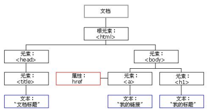

- 文档：一个页面就是一个文档，DOM 中使用 document 表示
- 元素：页面中的所有标签都是元素，DOM 中使用 element 表示
- 节点：网页中的所有内容都是节点（标签、属性、文本、注释等），DOM 中使用 node 表示

&emsp;DOM 把以上内容都看做是**对象**

#### 1.1 获取页面元素

1. 根据 ID 获取
   - `document.getElementByID('id');`
   - 传入值`id`为大小写敏感的**字符串**
   - 返回一个匹配特定 ID 的 DOM Element 对象，没有则返回 null
2. 根据标签名获取
   - `document.getElementsByTagName('标签名');`
   - 返回带有指定标签名的对象的集合，以伪数组的形式进行存储
   - 可以采取遍历的方法截取内部的元素对象
3. HTML5 新增的方法
   - `document.getElementsByClassName(‘类名’)；// 根据类名返回元素对象集合`
   - `document.querySelector('选择器'); // 根据指定选择器返回第一个元素对象`
   - `document.querySelectorAll('选择器'); // 根据指定选择器返回`
   - 其中，选择器的方式需要在传入选择器的时候需要加符号(eg. '#id' '.class')
4. 获取 body&HTML 元素
   - `var bodyEle = document.body;`
   - `var htmlEle = document.documentElement;`

### 二、事件基础

&emsp;事件：可以被 JavaScript 侦测到的行为(触发-响应机制)

1. 事件的组成(事件三要素)
   - 事件源：事件被触发的对象
   - 事件类型：如何触发，什么事件
   - 事件处理程序：通过一个函数赋值的方式完成
2. 执行事件的步骤
   - 获取事件源
   - 注册事件(绑定事件)
   - 添加事件处理程序(采取函数赋值的方式)

### 三、元素&节点操作

#### 3.1 操作元素

&emsp;JS 的 DOM 操作可以改变网页内容、结构和样式

1. 改变元素内容
   - `element.innerText;`从起始位置到终止位置的内容, 但它去除 html 标签， 同时空格和换行也会去掉
   - `element.innerHTML;`起始位置到终止位置的全部内容，包括 html 标签，同时保留空格和换行(PS:对 HTML 标签内的内容直接进行编辑)
   - 这两个属性都可以读写，可以获取元素里边的内容
2. 常用元素属性
   - innerText、innerHTML(改变元素内容)
   - src、href
   - id、alt、title
3. 修改表单属性
   - type、value、checked、selected、disabled
   - `element.innerHTML;` => 普通盒子
   - 表单里边的值、文字内容通过 Value 来修改
4. 样式属性操作
   - `element.style;`行内样式操作
   - `element.className;`类名样式操作
   - JS 里面的样式采取驼峰命名法 比如`fontSize`、`backgroundColor`
   - JS 修改 style 样式操作，产生的是行内样式，CSS 权重比较高
   - 如果样式修改较多，可以采取操作类名方式更改元素样式。
   - class 因为是个保留字，因此使用 className 来操作元素类名属性
   - className 会直接更改元素的类名，会覆盖原先的类名。

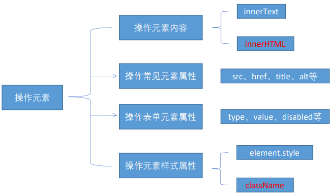

#### 3.2 节点操作

&emsp;网页中的所有内容都是节点（标签、属性、文本、注释等），在 DOM 中，节点使用 node 来表示。一般地，节点至少拥有 nodeType（节点类型）、nodeName（节点名称）和 nodeValue（节点值）这三个基本属性：

- 元素节点 nodeType 为 1
- 属性节点 nodeType 为 2
- 文本节点 nodeType 为 3 （文本节点包含文字、空格、换行等）

##### 3.2.1 节点层级

1. 父级节点
   - `node.parentNode`
   - 返回**最近的一个父节点**
   - 没有指定的父节点则返回 null
2. 子节点
   - `parentNode.childNodes（标准）`
     - 返回包含指定节点的**所有子节点**的集合，该集合为即时更新的集合
     - 返回值里面包含元素节点，文本节点等。如果只想要获得元素节点，则需要专门处理
   - ▲ `parentNode.children（非标准）`
     - 只读属性，返回**所有的子元素节点**。它只返回子元素节点，其余节点不返回
   - `parentNode.firstChild`
     - 返回第一个子节点，找不到则返回 null。包含所有的节点
   - `parentNode.lastChild`
     - 返回最后一个子节点，找不到则返回 null。包含所有的节点
   - `parentNode.firstElementChild`
     - 返回第一个子元素节点，找不到则返回 null(>=IE9)
   - `parentNode.lastElementChild`
     - 返回最后一个子元素节点，找不到则返回 null(>=IE9)
   - 如果想要第一个子元素节点，可以使用 `parentNode.chilren[0]`
   - 如果想要最后一个子元素节点，可以使用 `parentNode.chilren[parentNode.chilren.length - 1]`
3. 兄弟节点
   - `node.nextSibling`
     - 返回当前元素的下一个兄弟节点，找不到则返回 null。包含所有的节点
   - `node.previousSibling`
     - 返回当前元素上一个兄弟节点，找不到则返回 null。包含所有的节点
   - `node.nextElementSibling`
     - 返回当前元素下一个兄弟元素节点，找不到则返回 null(>=IE9)
   - `node.previousElementSibling`
     - 返回当前元素上一个兄弟元素节点，找不到则返回 null(>=IE9)

##### 3.2.2 节点操作

1. 创建节点(动态创建元素节点)
   - `document.createElement('tagName')`
   - 这些元素原先不存在，是根据我们的需求动态生成的，所以我们也称为动态创建元素节点
2. 添加节点
   - node.appendChild(child)
     - 将一个节点添加到指定父节点的子节点列表末尾。类似于 CSS 里面的 after 伪元素
   - node.insertBefore(child, 指定元素)
     - 将一个节点添加到父节点的指定子节点前面。类似于 CSS 里面的 before 伪元素
3. 删除节点
   - node.removeChild(child)
   - 从 DOM 中删除一个子节点，返回删除的节点
4. 复制节点
   - node.cloneNode()
   - 返回调用该方法的节点的一个副本。也称为克隆节点/拷贝节点
   - 如果括号参数为空或者为 false ，则是浅拷贝，即只克隆复制节点本身，不克隆里面的子节点
   - 如果括号参数为 true ，则是深度拷贝，会复制节点本身以及里面所有的子节点。
5. 三种动态创建元素的区别
   - `document.write` 是直接将内容写入页面的内容流，但是文档流执行完毕，则它会导致页面全部重绘，**不推荐使用**
   - `innerHTML` 是将内容写入某个 DOM 节点，不会导致页面全部重绘
   - `innerHTML` 创建多个元素效率更高（不要拼接字符串，采取数组形式拼接），结构稍微复杂
   - `createElement()` 创建多个元素效率稍低一点点，但是结构更清晰
   - 总结：不同浏览器下，innerHTML 效率要比 creatElement 高；**大段文字插入的时候考虑**`innerHTML`

#### 3.3 DOM 重点操作

> 创建、增、删、改、查、属性操作、事件操作

1. 创建
   - `document.write`
   - `innerHTML`
   - `createElement`
2. 增
   - `appendChild`
   - `insertBefore`
3. 删
   - `removeChild`
4. 改
   - 修改元素属性： src、href、title 等
   - 修改普通元素内容： innerHTML 、innerText
   - 修改表单元素： value、type、disabled 等
   - 修改元素样式： style、className
5. 查
   - DOM 提供的 API 方法：`getElementById`、`getElementsByTagName`古老用法 不太推荐
   - H5 提供的新方法：`querySelector`、`querySelectorAll` 提倡
   - 利用节点操作获取元素： 父(parentNode)、子(children)、兄(previousElementSibling、nextElementSibling) 提倡
6. 属性操作
   - `setAttribute`：设置 dom 的属性值
   - `getAttribute`：得到 dom 的属性值
   - `removeAttribute` 移除属性
7. 事件操作

### 四、事件详解

#### 4.1 注册事件

&emsp;给元素添加事件，称为注册事件/绑定事件

1. 传统注册方式
   - 利用 on 开头的事件(eg. `onclick`)
   - `<button onclick=“alert('hi~')”></button>` 或 `btn.onclick = function() {}`
   - 特点：注册事件的**唯一性** => 同一个元素同一个事件只能设置一个处理函数，最后注册的处理函数将会**覆盖**前面注册的处理函数
2. 方法监听方式
   - W3C 标准 推荐方式
   - `addEventListener()` 是一个方法
   - IE9 之前的 IE 不支持此方法，可使用 `attachEvent()` 代替
   - 特点：同一个元素同一个事件可以注册**多个**监听器 => 按注册顺序依次执行

&emsp;以上为两类绑定的方式，在实际中经常使用以下具体方法

- `addEventListener` 事件监听方式
  - `eventTarget.addEventListener(type,listener[ ,useCapture])`
  - 将指定的监听器注册到 eventTarget（目标对象）上，当该对象触发指定的事件时，就会执行事件处理函数
  - type：事件类型**字符串**，比如 click 、mouseover ，注意这里**不带 on**
  - listener：事件处理函数，事件发生时，会调用该监听函数
  - useCapture：可选参数，是一个布尔值，默认是 false
- `attachEvent` 事件监听方式
  - `eventTarget.attachEvent(eventNameWithOn, callback)`
  - 将指定的监听器注册到 eventTarget（目标对象） 上，当该对象触发指定的事件时，指定的回调函数就会被执行
  - eventNameWithOn：事件类型**字符串**，比如 onclick 、onmouseover ，这里**要带 on**
  - callback： 事件处理函数，当目标触发事件时回调函数被调用

#### 4.2 删除事件(解绑)

1. 传统注册方式
   - `eventTarget.onclick = null;`
2. 方法监听注册方式
   - `eventTarget.removeEventListener(type, listener[, useCapture]);`
   - `eventTarget.detachEvent(eventNameWithOn, callback);`

#### 4.3 DOM 事件流

&emsp;DOM 事件流描述的是从页面中接收事件的**顺序**。事件发生时会在元素节点之间**按照特定的顺序传播**，这个传播过程即 DOM 事件流  
&emsp;DOM 事件流分为 3 个阶段：捕获阶段 -> 当前目标阶段 -> 冒泡阶段

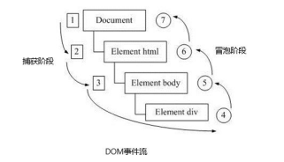
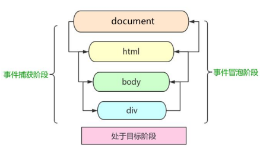

- 事件捕获(body -> div)：网景最早提出，由 DOM 最顶层节点开始，然后逐级向下传播到到最具体的元素接收的过程。
- 事件冒泡(div -> body)：IE 最早提出，事件开始时由最具体的元素接收，然后逐级向上传播到到 DOM 最顶层节点的过程。

1. **JS 代码中只能执行捕获或者冒泡其中的一个阶段**。
2. `onclick` 和 `attachEvent` 只能得到冒泡阶段。
3. `addEventListener(type, listener[, useCapture])`第三个参数如果是 true，表示在事件捕获阶段调用事件处理程序；如果是 false（不写默认就是 false），表示在事件冒泡阶段调用事件处理程序。
4. 实际开发中我们很少使用事件捕获，我们更关注事件冒泡。
5. 有些事件是没有冒泡的，比如 `onblur、onfocus、onmouseenter、onmouseleave`

#### 4.4 事件对象

```javascript
eventTarget.onclick = function (event) {};
eventTarget.addEventListener('click', function (event) {});
// 这个 event 就是事件对象，我们还喜欢的写成 e 或者 evt
```

&emsp;event 对象代表事件的状态，比如键盘按键的状态、鼠标的位置、鼠标按钮的状态。简单理解就是事件发生后，跟事件相关的一系列信息数据的集合都放到这个对象里面，这个对象就是事件对象 event，它有很多属性和方法。  
&emsp;事件对象可以当作形参来看，系统帮我们设定为事件对象，不需要传递实参过去。只有有了事件才会存在

|   事件对象属性方法    |                     说明                     |
| :-------------------: | :------------------------------------------: |
|      `e.target`       |           返回触发事件的对象(标准)           |
|    `e.srcElement`     |          返回触发事件的对象(非标准)          |
|       `e.type`        |     返回事件的类型，比如 click(不带 on)      |
|   `e.cancelBubble`    |             阻止事件冒泡(非标准)             |
| `e.stopPropagation()` |              阻止事件冒泡(标准)              |
|    `e.returnValue`    | 阻止事件的默认行为(非标准，比如不让链接转跳) |
| `e.preventDefault()`  |           阻止事件的默认行为(标准)           |

**e.target 和 this 的区别：**  
 this 是事件绑定的元素，这个函数的调用者（绑定这个事件的元素）  
 e.target 是事件触发的元素

#### 4.5 阻止冒泡

1. 标准写法：利用事件对象里面的 stopPropagation()方法

   ```javascript
   e.stopPropagation();
   ```

2. 非标准写法：IE 6-8 利用事件对象 cancelBubble 属性

   ```javascript
   e.cancelBubble = true;
   ```

3. 阻止事件冒泡的兼容性解决方案

   ```javascript
   if (e && e.stopPropagation) {
     e.stopPropagation();
   } else {
     window.event.cancelBubble = true;
   }
   ```

#### 4.6 事件委托(代理、委派)

&emsp;事件委托也称为事件代理， 在 jQuery 里面称为事件委派。  
&emsp;事件委托的原理：**不是每个子节点单独设置事件监听器，而是事件监听器设置在其父节点上，然后利用冒泡原理影响设置每个子节点。**  
&emsp;事件委托的作用：只操作了一次 DOM，**提高了程序的性能**

#### 4.7 鼠标、键盘事件

1. 常见的鼠标事件

   |   鼠标事件    |     触发条件     |
   | :-----------: | :--------------: |
   |   `onclick`   | 鼠标左键点击触发 |
   | `onmouseover` |   鼠标经过触发   |
   | `onmouseout`  |   鼠标离开触发   |
   |   `onfocus`   | 获得鼠标焦点触发 |
   |   `onblur`    |   失去焦点触发   |
   | `onmousemove` |   鼠标移动触发   |
   |  `onmouseup`  |   鼠标弹起触发   |
   | `onmousedown` |   鼠标按下触发   |

2. 禁止鼠标右键菜单

   - contextmenu 主要控制应该何时显示上下文菜单，主要用于程序员取消默认的上下文菜单

   ```javascript
   document.addEventListener('contextmenu', function (e) {
     e.preventDefault();
   });
   ```

3. 禁止鼠标选中（selectstart 开始选中）

   ```javascript
   document.addEventListener('selectstart', function (e) {
     e.preventDefault();
   });
   ```

4. 鼠标事件对象

   | 鼠标事件对象 |                      说明                      |
   | :----------: | :--------------------------------------------: |
   | `e.clientX`  | 返回鼠标相对于 Browser 窗口**可视区**的 X 坐标 |
   | `e.clientY`  | 返回鼠标相对于 Browser 窗口**可视区**的 Y 坐标 |
   |  `e.pageX`   |   返回鼠标相对于**文档页面**的 X 坐标(IE9+)    |
   |  `e.pageY`   |   返回鼠标相对于**文档页面**的 Y 坐标(IE9+)    |
   | `e.screenX`  |      返回鼠标相对于**电脑屏幕**的 X 坐标       |
   | `e.screenY`  |      返回鼠标相对于**电脑屏幕**的 Y 坐标       |

5. 键盘事件

   |   键盘事件   |                触发条件                |
   | :----------: | :------------------------------------: |
   |  `onkeyup`   |        某个键盘按键被松开时触发        |
   | `onkeydown`  |        某个键盘按键被按下时触发        |
   | `onkeypress` | 某个键盘按键被按下时触发(不识别功能键) |

   - 如果使用`addEventListener`不需要加 `on`
   - `onkeypress` 和前面 2 个的区别是，它不识别功能键，比如左右箭头，shift 等，且它会区分字母大小写
   - 三个事件的执行顺序是： keydown --> keypress ---> keyup
   - `keydown` 和 `keypress` 在文本框里面的特点： 他们两个事件触发的时候，文字还没有落入文本框中。`keyup`事件触发的时候， 文字已经落入文本框里面了

6. 键盘事件对象

   | 键盘事件对象 |        说明         |
   | :----------: | :-----------------: |
   |  `keyCode`   | 返回该键的 ASCII 值 |

### 五、BOM & 定时器

#### 5.1 BOM

&emsp;BOM(Browser Object Model，浏览器对象模型)  
&emsp;提供了独立于内容而与浏览器窗口进行交互的对象，核心对象是 Window；它比 DOM 更大，包含了 DOM

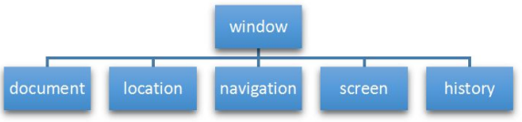

| DOM                                      | BOM                                              |
| :--------------------------------------- | :----------------------------------------------- |
| 文档对象模型                             | 浏览器对象模型                                   |
| 把「**文档**」当做一个「**对象**」来看待 | 把「**浏览器**」当做一个「**对象**」来看待       |
| DOM 的顶级对象是 document                | BOM 的顶级对象是 window                          |
| DOM 主要学习的是操作页面元素             | BOM 学习的是浏览器窗口交互的一些对象             |
| DOM 是 W3C 标准规范                      | BOM 是浏览器厂商在各自浏览器上定义的，兼容性较差 |

&emsp;window 对象是浏览器的顶级对象，它具有双重角色。  
&emsp;1.它是 JS 访问浏览器窗口的一个接口。  
&emsp;2.它是一个全局对象。定义在全局作用域中的变量、函数都会变成 window 对象的属性和方法。  
&emsp;在调用的时候可以省略 window，对话框都属于 window 对象方法，如 alert()、prompt() 等。

#### 5.2 Window 对象常见事件

1. 窗口加载事件

   - `window.onload` 是一个事件，在文档加载完成后能立即触发，并且能够为该事件注册事件处理函数。将要对对象或者模块进行操作的代码存放在处理函数中。即：window.onload =function (){这里写操作的代码};

   ```javascript
   window.onload = function () {};
   // 或者
   window.addEventListener('load', function () {});
   ```

   - 有了 `window.onload` 就可以把 JS 代码写到页面元素的上方，因为 onload 是等页面内容全部加载完毕，再去执行处理函数。
   - `window.onload` 传统注册事件方式 只能写一次，如果有多个，会以最后一个 `window.onload` 为准。
   - `document.addEventListener('DOMContentLoaded',function(){})` 当纯 HTML 被完全加载以及解析时，DOMContentLoaded 事件会被触发，而不必等待样式表，图片或者子框架完成加载。

2. 调整窗口大小事件

   - `window.onresize` 是调整窗口大小加载事件, 当触发时就调用的处理函数。

   ```javascript
   window.onresize = function () {};
   // 或者
   window.addEventListener('resize', function () {});
   ```

#### 5.3 定时器

1. setTimeout() 定时器
   - `window.setTimeout(调用函数, [延迟的毫秒数]);`
   - 用于设置一个定时器，该定时器在**定时器到期后执行调用函数**。
   - 这个调用函数可以直接写函数，或者写函数名或者采取字符串‘函数名()'三种形式。第三种不推荐
   - 延迟的毫秒数省略默认是 0，如果写，**必须是毫秒**
2. 停止 setTimeout() 定时器
   - `window.clearTimeout(timeoutID)`
   - **参数为定时器的标识符**
3. setInterval() 定时器
   - `window.setInterval(回调函数, [间隔的毫秒数]);`
   - **重复调用**一个函数，每隔这个时间，就去调用一次回调函数。
   - 这个调用函数可以直接写函数，或者写函数名或者采取字符串 '函数名()' 三种形式。
   - 间隔的毫秒数省略默认是 0，如果写，**必须是毫秒**，表示每隔多少毫秒就自动调用这个函数。
   - **第一次执行也是间隔毫秒数之后执行，之后每隔毫秒数就执行一次。**
4. 停止 setInterval() 定时器
   - `window.clearInterval(intervalID);`
   - **参数为定时器的标识符**
5. 定时器的 name 设置为全局变量并初始化为 Null => 便于其他函数访问

### 六、JS 执行机制

> JavaScript -> 单线程

#### 6.1 同步&异步

> 同步和异步关注的是消息通信机制 (synchronous communication/ asynchronous communication)。同步，就是调用某个东西时，调用方得等待这个调用返回结果才能继续往后执行。异步，和同步相反，调用方不会等待得到结果，而是在调用发出后调用者可以继续执行后续操作，被调用者通过状体来通知调用者，或者通过回调函数来处理这个调用

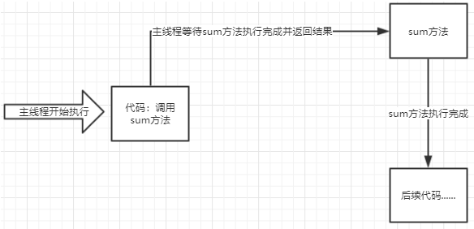
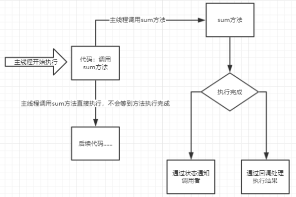

1. 同步任务
   - 同步任务都在主线程上执行，形成一个**执行栈**。
2. 异步任务
   - JS 的异步是通过回调函数实现的。
   - 一般而言，异步任务有以下三种类型:
     - 普通事件，如 click、resize 等
     - 资源加载，如 load、error 等
     - 定时器，包括 setInterval、setTimeout 等
   - 异步任务把相关回调函数添加到任务队列中（任务队列也称为消息队列）。

#### 6.2 执行机制

1. 先执行执行栈中的同步任务。
2. 异步任务（回调函数）放入任务队列中。
3. 一旦执行栈中的所有同步任务执行完毕，系统就会按次序读取任务队列中的异步任务，于是被读取的异步任务结束等待状态，进入执行栈，开始执行。

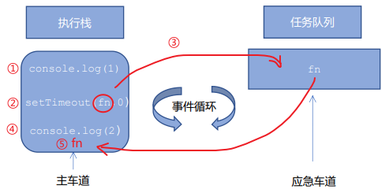
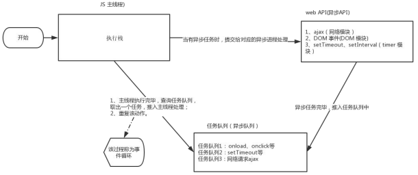

&emsp;由于主线程不断的重复获得任务、执行任务、再获取任务、再执行，所以这种机制被称为事件循环（ event loop）。

### 七、location/navigator/history 对象

1. location 对象

   - window 对象给我们提供了一个 location **属性**用于获取或设置窗体的 URL，并且可以用于解析 URL。因为这个属性**返回的是一个对象**，所以我们将这个属性也称为 location 对象。

   |  location 对象属性  |           返回值            |
   | :-----------------: | :-------------------------: |
   |   `location.href`   |    获取或者设置整个 URL     |
   |   `location.host`   |       返回主机(域名)        |
   |   `location.port`   | 返回端口号 未写返回空字符串 |
   | `location.pathname` |          返回路径           |
   |  `location.search`  |          返回参数           |
   |   `location.hash`   |  返回片段 常见于链接 锚点   |

   |    location 对象方法    |                      返回值                       |
   | :---------------------: | :-----------------------------------------------: |
   | `location.assign(url)`  |   跟 href 一样，可以转跳页面(重定向)，可以后退    |
   | `location.replace(url)` |    替换当前页面，因为不记录历史，所以不能后退     |
   |   `location.reload()`   | 重新加载页面，相当于 f5，参数为 true 则为 ctrl+f5 |

2. navigator 对象
3. history 对象
   - 与浏览器历史记录进行交互

| history 对象方法 |                  作用                  |
| :--------------: | :------------------------------------: |
|     `back()`     |              可以后退功能              |
|   `forward()`    |                前进功能                |
|    `go(参数)`    | 参数:1 前进 1 个页面；-1 后退 1 个页面 |

### 八、网页特效 三大系列

#### 8.1 元素偏移量 offset 系列

> offset 翻译过来就是偏移量， 我们使用 offset 系列相关属性可以动态的得到该元素的位置（偏移）、大小等。

- 获得元素距离带有定位父元素的位置
- 获得元素自身的大小（宽度高度）
- 返回的数值都不带单位

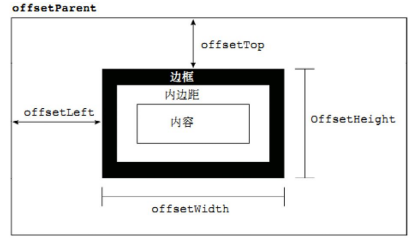

|    offset 系列属性     |                      作用                       |
| :--------------------: | :---------------------------------------------: |
| `element.offsetParent` | 返回该元素的带有定位的父级元素，没有则返回 body |
|  `element.offsetTop`   |   返回元素相对带有定位的父元素的上方的偏移量    |
|  `element.offsetLeft`  |   返回元素相对带有定位的父元素的左方的偏移量    |
| `element.offsetWidth`  |  返回自身包括 padding、**边框**、内容区的宽度   |
| `element.offsetHeight` |  返回自身包括 padding、**边框**、内容区的高度   |

| offset                                         | style                                         |
| :--------------------------------------------- | :-------------------------------------------- |
| offset 可以得到任意样式表中的样式值            | style 只能得到行内样式表中的样式值            |
| offset 系列获得的数值是没有单位的              | style.width 获得的是带有单位的字符串          |
| offsetWidth 包含 padding+border+width          | style.width 获得不包含 padding 和 border 的值 |
| offsetWidth 等属性是只读属性，只能获取不能赋值 | style.width 是可读写属性，可以获取也可以赋值  |
| 获取元素大小位置，用 offset 更合适             | 给元素更改值，则需要用 style 改变             |

#### 8.2 元素可视区 client 系列

> client 翻译过来就是客户端，我们使用 client 系列的相关属性来获取元素可视区的相关信息。通过 client 系列的相关属性可以动态的得到该元素的边框大小、元素大小等。

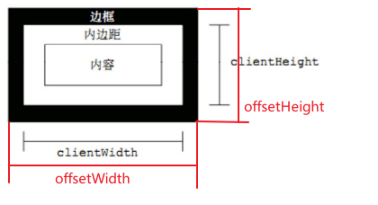

|    client 系列属性     |                               作用                               |
| :--------------------: | :--------------------------------------------------------------: |
|  `element.clientTop`   |                       返回元素上边框的大小                       |
|  `element.clientLeft`  |                       返回元素左边框的大小                       |
| `element.clientWidth`  | 返回自身包括 padding、内容区的宽度，**不含边框**，返回值不带单位 |
| `element.clientHeight` | 返回自身包括 padding、内容区的高度，**不含边框**，返回值不带单位 |

#### 8.3 元素滚动 scroll 系列

> scroll 翻译过来就是滚动的，我们使用 scroll 系列的相关属性可以动态的得到该元素的大小、滚动距离等。返回数值不带单位

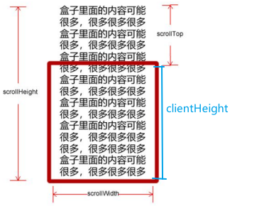

|    scroll 系列属性     |             作用             |
| :--------------------: | :--------------------------: |
|  `element.scrollTop`   |     返回被卷去的上侧距离     |
|  `element.scrollLeft`  |     返回被卷去的左侧距离     |
| `element.scrollWidth`  | 返回自身实际的宽度，不含边框 |
| `element.scrollHeight` | 返回自身实际的高度，不含边框 |

- 页面被卷去的头部：如果浏览器的高（或宽）度不足以显示整个页面时，会自动出现滚动条。当滚动条向下滚动时，**页面上面被隐藏掉的高度，我们就称为页面被卷去的头部**。
- **页面被卷去的头部**可以通过 window.pageYOffset 获得；如果是被卷去的左侧 window.pageXOffset。
- **元素被卷去的头部**是 element.scrollTop

#### 8.4 总结

1. `offset` 系列 经常用于获得元素位置 offsetLeft offsetTop
2. `client` 经常用于获取元素大小 clientWidth clientHeight
3. `scroll` 经常用于获取滚动距离 scrollTop scrollLeft
4. 注意页面滚动的距离通过 window.pageXOffset 获得

### 九、缓动动画

1. **动画实现核心原理**：通过定时器 setInterval() 不断移动盒子位置。
2. 缓动动画就是让元素运动速度有所变化，最常见的是让速度慢慢停下来。**思路**：
   - 让盒子每次移动的距离慢慢变小，速度就会慢慢落下来。
   - 核心算法：(目标值 - 现在的位置 )/10 作为每次移动的距离 步长
   - 停止的条件是： 让当前盒子位置等于目标位置就停止定时器
   - 注意步长值需要取整
     - 如果是正值，则步长 往大了取整
     - 如果是负值，则步长 往小了取整
3. 动画函数添加回调函数
   - 回调函数原理：函数可以作为一个参数。将这个函数作为参数传到另一个函数里面，当那个函数执行完之后，再执行传进去的这个函数，这个过程就叫做回调。
   - 回调函数写的位置：定时器结束的位置
4. **节流阀**
   - 节流阀目的：当上一个函数动画内容执行完毕，再去执行下一个函数动画，让事件无法连续触发。
   - 核心实现思路：利用回调函数，添加一个变量来控制，锁住函数和解锁函数。

### 十、本地存储

#### 10.1 本地存储特性

1. 数据存储在用户浏览器中
2. 设置、读取方便、甚至页面刷新不丢失数据
3. 容量较大，sessionStorage 约 5M、localStorage 约 20M
4. 只能存储字符串，可以将对象 JSON.stringify() 编码后存储

#### 10.2 window.sessionStorage

1. 生命周期为关闭浏览器窗口
2. 在同一个窗口(页面)下数据可以共享
3. 以键值对的形式存储使用

- 存储数据：`sessionStorage.setItem(key, value)`
- 获取数据：`sessionStorage.getItem(key)`
- 删除数据：`sessionStorage.removeItem(key)`
- 删除所有数据：`sessionStorage.clear()`

#### 10.3 window.localStorage

1. 声明周期永久生效，除非手动删除 否则关闭页面也会存在
2. 可以多窗口（页面）共享（同一浏览器可以共享）
3. 以键值对的形式存储使用
4. 只能存储字符串

- 存储数据：`localStorage.setItem(key, value)`
- 获取数据：`localStorage.getItem(key)`
- 删除数据：`localStorage.removeItem(key)`
- 删除所有数据：`localStorage.clear()`

### 十一、移动端网页特效

> 移动端浏览器兼容性较好，不需要考虑以前 JS 的兼容性问题

| 触屏 touch 事件 |              说明               |
| :-------------: | :-----------------------------: |
|  `touchstart`   |  手指触摸到一个 DOM 元素时触发  |
|   `touchmove`   | 手指在一个 DOM 元素上滑动时触发 |
|   `touchend`    | 手指从一个 DOM 元素上移开时触发 |

| 触屏事件对象(TouchEvent) |                 说明                  |
| :----------------------: | :-----------------------------------: |
|        `touches`         |   正在触摸屏幕的所有手指的一个列表    |
|     `targetTouches`      | 正在触摸当前 DOM 元素的手指的一个列表 |
|     `changedTouches`     |       手指状态发生了改变的列表        |

&emsp;移动端拖动元素

1. `touchstart、touchmove、touchend` 可以实现拖动元素
2. 但是拖动元素需要当前手指的坐标值 我们可以使用 `targetTouches[0]` 里面的 `pageX` 和 `pageY`
3. 移动端拖动的原理： 手指移动中，计算出手指移动的距离。然后用盒子原来的位置 + 手指移动的距离
4. 手指移动的距离： 手指滑动中的位置 减去 手指刚开始触摸的位置
5. 拖动元素三步曲：
   - 触摸元素 `touchstart`： 获取手指初始坐标，同时获得盒子原来的位置
   - 移动手指 `touchmove`： 计算手指的滑动距离，并且移动盒子
   - 离开手指 `touchend`:
   - 注意：手指移动也会触发滚动屏幕所以这里要阻止默认的屏幕滚动 `e.preventDefault();`

&emsp;移动端 click 事件会有 300ms 的延时，原因是移动端屏幕双击会缩放(double tap to zoom) 页面。

---

## Part Ⅲ

---

## Part Ⅳ 附录
